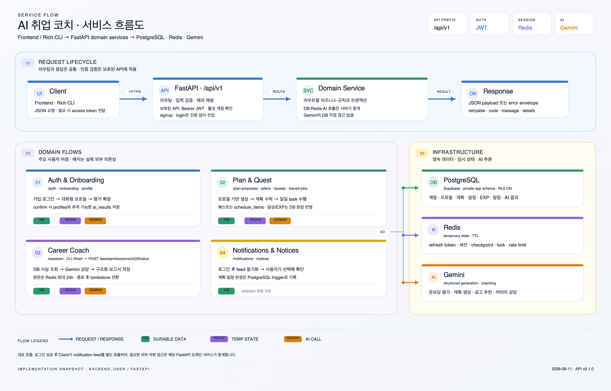

# AI 취업 코치

> 대화형 온보딩으로 취업 목표와 역량을 파악하고, 개인화 로드맵·오늘의 퀘스트·채용 공고 추천·AI 상담을 제공하는 취업 준비 코칭 서비스입니다.

`AIO-01 · P1 · Team 2`

사용자·관리자 Streamlit 화면과 FastAPI 서버, Supabase PostgreSQL, Upstash Redis, Gemini를 하나의 서비스 흐름으로 연결했습니다.

## 핵심 설계

### 서비스 흐름도

[](backend_user/docs/images/service-flow.png)

Frontend/Rich CLI의 요청이 FastAPI 도메인 서비스를 거쳐 PostgreSQL·Redis·Gemini와 상호작용하는 흐름입니다. 이미지를 클릭하면 4000 × 2560 원본으로 볼 수 있습니다.

### 데이터베이스 구조도

[](backend_user/docs/images/database-structure.png)

Supabase PostgreSQL 17.6의 private `app` 스키마를 기준으로 한 구조입니다. 2026-08-11 실DB 점검 당시 9개 테이블, 127개 컬럼, 16개 외래 키와 전체 테이블의 RLS 적용을 확인했습니다. 현재 원격 DB 상태는 배포 전에 다시 확인해야 합니다.

## 프로젝트 한눈에 보기

AI 취업 코치는 사용자의 목표를 단순히 기록하는 데서 끝나지 않고, 실행 가능한 계획과 매일의 행동으로 연결합니다. AI가 만든 계획은 사용자가 검토하고 수락한 뒤에만 활성화되며, 퀘스트 완료·취소에 따라 진행률과 EXP가 일관되게 반영됩니다.

### 핵심 사용자 여정

```text
회원가입·로그인
  → Gemini 대화형 온보딩
  → 프로필·취업 준비도 확정
  → 개인화 로드맵 제안·수락
  → 오늘의 퀘스트 수행·EXP 반영
  → 맞춤 공고 확인·AI 취업 상담
  → 관리자 화면에서 사용자·로드맵·공지 조회
```

### 사용자 성장 캐릭터 예시

퀘스트 수행과 EXP 누적에 따른 사용자 성장 상태를 친근하게 전달하기 위한 AI 코치 캐릭터 예시입니다. 현재 저장소의 UI 자산이며, 실제 레벨별 EXP 기준과 화면 적용 규칙은 사용자 화면 연동 시 확정합니다.

<table>
  <tr>
    <th>Level 1 · 취업 준비 시작</th>
    <th>Level 2 · 역량 탐색</th>
    <th>Level 3 · 집중 성장</th>
    <th>Level 4 · 목표 달성</th>
  </tr>
  <tr>
    <td></td>
    <td></td>
    <td></td>
    <td></td>
  </tr>
</table>

캐릭터는 사용자 홈·대시보드·프로필에서 현재 성장 단계를 나타내고, 퀘스트 완료나 일일 목표 달성 시 다음 단계로 성장하는 시각적 피드백에 활용할 수 있습니다.

#### 캐릭터 성장 애니메이션 예시

퀘스트 완료와 EXP 누적에 따른 성장 과정을 사용자에게 보여주는 애니메이션 예시입니다.

<p align="center">
  
</p>

## 시스템 구성

| 구성 요소 | 역할 | 주요 기술 |
|---|---|---|
| [`frontend_user/`](frontend_user/) | 로그인, AI 프로필 분석, 대시보드, 로드맵, 오늘 할 일, 맞춤 공고, AI 상담 | Streamlit, httpx, pandas, matplotlib |
| [`backend_user/`](backend_user/) | 인증, 온보딩, 프로필, 계획·퀘스트·EXP, 알림, 공고 추천, AI 상담 API | FastAPI, Pydantic, psycopg, Redis, Gemini, JWT |
| [`frontend_admin/`](frontend_admin/) | 관리자 로그인, 운영 대시보드, 사용자 목록·상세, 사용자별 로드맵, 공지와 저장 공고 조회 | Streamlit, httpx, pandas, Altair |
| [`backend_admin/`](backend_admin/) | 관리자 인증, 사용자 관리, 공지 CRUD, 대시보드, 공고, AI 로그·KPI API | FastAPI, Pydantic, Supabase, JWT |
| Supabase PostgreSQL | 계정·프로필·로드맵·일정·EXP·알림·AI 결과 영속 저장 | PostgreSQL 17.6, private schema, RLS |
| Upstash Redis | 온보딩·상담 세션, refresh token, checkpoint, lock, rate limit | Redis, TTL |
| Gemini | 온보딩 평가, 계획 생성, 공고 추천, 커리어 상담 | Google GenAI SDK |

## 주요 기능

- 자체 계정 기반 회원가입·로그인·내 정보 수정·탈퇴와 JWT 인증
- Gemini 자유대화 기반 온보딩, 프로필 추출과 취업 준비도 평가
- 프로필·선택 공고 기반 로드맵 제안, 사용자 수락·거절과 이력 보존
- 오늘의 퀘스트 완료 상태, 계획 진행률과 일일 목표 `+20 EXP` 반영
- 전체 채용 공고 조회, 사용자 프로필 기반 맞춤 공고 추천
- Redis 세션과 구조화 보고서를 사용하는 AI 취업 코치 상담
- 로그인 시 로드맵 일정·변경 알림 동기화와 공지 조회
- 관리자용 사용자·로드맵·공지·운영 지표·저장 공고 조회 API
- AI 로그·KPI·피드백 API 계층(필요 DB migration과 관리자 로그 화면은 미완성)

## API 한눈에 보기

배포 주소는 [`render.yaml`](render.yaml)과 [프론트엔드–백엔드 연동 운영 문서](docs/FRONTEND_BACKEND_INTEGRATION.md)의 설정을 기준으로 합니다.

| API | 기준 URL | 주요 도메인 | Swagger / 상세 명세 |
|---|---|---|---|
| 사용자 API | `https://aio-01-p1-team2-1.onrender.com/api/v1` | `auth`, `onboarding`, `profile`, `plan-proposals`, `plans`, `quests`, `saved-jobs`, `notifications`, `notices`, `assistant` | [배포 Swagger](https://aio-01-p1-team2-1.onrender.com/docs) · [API 명세](backend_user/docs/API_SPEC.md) |
| 관리자 API | `https://aio-01-p1-team2.onrender.com/api/v1` | 관리자 인증, 사용자·로드맵, 공지, 대시보드, 공고, AI 로그·피드백 | [배포 Swagger](https://aio-01-p1-team2.onrender.com/docs) · [API 명세](backend_admin/API_SPEC.md) |

로컬 Swagger는 사용자 API `http://127.0.0.1:8010/docs`, 관리자 API `http://127.0.0.1:8000/docs`에서 확인할 수 있습니다. OpenAPI JSON은 각 서버의 `/openapi.json`에서 런타임에 생성됩니다.

## 통합 문서 허브

API 명세와 공통 연동 문서는 현재 구현 기준입니다. `초기 예제`로 표시한 하위 문서는 개발 초기에 작성된 자료로, 현재 화면과 실행 방법은 이 통합 README를 기준으로 확인합니다.

| 영역 | 폴더·README | API·연동 | 실행·설정 및 기타 문서 |
|---|---|---|---|
| 사용자 백엔드 | [폴더](backend_user/) · [README](backend_user/README.md) | [사용자 API 명세](backend_user/docs/API_SPEC.md) | [CLI 가이드](backend_user/docs/CLI.md) · [환경 변수 예시](backend_user/.env.example) · [실행 스크립트](backend_user/run.sh) |
| 관리자 백엔드 | [폴더](backend_admin/) · [README (초기 예제)](backend_admin/README.md) | [관리자 API 명세](backend_admin/API_SPEC.md) | [환경 변수 예시](backend_admin/.env.example) · [실행 스크립트](backend_admin/run.sh) · [초기 계획](backend_admin/PLAN.md) |
| 사용자 프론트엔드 | [폴더](frontend_user/) · [README (초기 예제)](frontend_user/README.md) | [API 클라이언트](frontend_user/clients/) · [공통 API 처리](frontend_user/core/api_client.py) | [설치 문서 (초기 예제)](frontend_user/setup.md) · [환경 변수 예시](frontend_user/.env.example) · [현행 화면 구성](frontend_user/app.py) |
| 관리자 프론트엔드 | [폴더](frontend_admin/) · [README (초기 예제)](frontend_admin/README.md) | [API 클라이언트](frontend_admin/clients/) · [공통 API 처리](frontend_admin/core/api_client.py) | [설치 문서 (초기 예제)](frontend_admin/setup.md) · [환경 변수 예시](frontend_admin/.env.example) · [현행 화면 구성](frontend_admin/app.py) |

### 공통 문서

- [전체 개발 계획서](develop_update_plan.md): 요구사항, 사용자 흐름, 화면·API·DB 설계, 역할 분담, 테스트와 완료 기준
- [프론트엔드–백엔드 연동 운영 문서](docs/FRONTEND_BACKEND_INTEGRATION.md): 서비스 URL, API 계약, 환경 변수, 배포와 검증 절차
- [Render 배포 Blueprint](render.yaml): 사용자·관리자 FastAPI 서비스의 빌드, 실행 명령과 환경 변수
- [통합 수정 설계](docs/designs/2026-08-11-integration-fix-design.md) · [통합 수정 계획](docs/plans/2026-08-11-integration-fix.md)
- [최종 프로젝트 문서](docs/revised/Project_README.md) · [API 명세](docs/revised/API명세서.md) · [화면 설계](docs/revised/화면설계.md) · [DB 설계](docs/revised/데이터베이스설계.md) · [대시보드 결과](docs/revised/대시보드_구현결과.md)

서비스 간 URL과 API 계약은 공통 연동 운영 문서와 사용자·관리자 API 명세를 기준으로 확인합니다.

## 기술 스택

| 구분 | 기술 |
|---|---|
| Frontend | Python, Streamlit 1.41.1, pandas, matplotlib, httpx |
| Backend | Python 3.12, FastAPI, Pydantic, Uvicorn |
| Data | Supabase PostgreSQL 17.6, psycopg, Upstash Redis |
| AI | Gemini, Google GenAI SDK, Rich CLI |
| Auth & Security | JWT access/refresh token, Argon2, RLS |
| Test & Quality | pytest, pytest-asyncio, Ruff |
| Deployment | Render(백엔드 2개), 프론트엔드는 로컬 또는 별도 Streamlit 배포 필요 |

## 로컬 실행

각 서비스의 `.env.example`을 참고해 환경 변수를 먼저 설정합니다. 아래 네 프로세스는 각각 별도 터미널에서 실행합니다.

### 백엔드

```bash
# 사용자 API: http://127.0.0.1:8010
cd backend_user
uv sync --frozen
./run.sh
```

```bash
# 관리자 API: http://127.0.0.1:8000
cd backend_admin
python -m pip install -r requirements.txt
./run.sh
```

### 프론트엔드

```bash
# 사용자 화면: http://localhost:8501
cd frontend_user
python -m pip install -r requirements.txt
BACKEND_URL=http://127.0.0.1:8010/api/v1 \
  python -m streamlit run app.py --server.port 8501
```

```bash
# 관리자 화면: http://localhost:8502
cd frontend_admin
python -m pip install -r requirements.txt
BACKEND_USER_URL=http://127.0.0.1:8010/api/v1 \
BACKEND_ADMIN_URL=http://127.0.0.1:8000/api/v1 \
  python -m streamlit run app.py --server.port 8502
```

Render의 배포 API를 사용할 때는 프론트엔드 환경 변수 예시의 기본 URL을 사용하면 됩니다. 자세한 설정은 [연동 운영 문서](docs/FRONTEND_BACKEND_INTEGRATION.md)를 참고하세요.

## 테스트

프론트엔드의 `requirements.txt`에는 `pytest`가 포함되어 있지 않으므로, 각 프론트엔드 가상환경에는 테스트 실행 전에 별도로 설치합니다.

```bash
# 사용자 백엔드
cd backend_user
uv run --frozen pytest

# 관리자 백엔드
cd ../backend_admin
pytest -q

# 사용자 프론트엔드
cd ../frontend_user
python -m pip install pytest
pytest -q

# 관리자 프론트엔드
cd ../frontend_admin
python -m pip install pytest
pytest -q
```

## 저장소 구조

```text
.
├── backend_user/       # 사용자 FastAPI, Rich CLI, 사용자 API 명세와 다이어그램
├── backend_admin/      # 관리자 FastAPI와 관리자 API 명세
├── frontend_user/      # 사용자 Streamlit 애플리케이션
├── frontend_admin/     # 관리자 Streamlit 애플리케이션
├── docs/               # 프론트–백엔드 통합·운영 문서
├── develop_update_plan.md
└── render.yaml         # 두 백엔드의 Render 배포 설정
```

## 현재 제한사항

- 관리자 공지 생성·수정·삭제, 사용자 상태 변경·삭제는 백엔드 API가 있으나 관리자 화면에 완전히 연결되지 않았습니다.
- 관리자 저장 공고 기능은 현재 목록·상세 조회 전용입니다.
- AI 로그·KPI·피드백 Router·Service·Repository 코드는 있으나 `app.ai_logs`, `app.admin_log_summary`, `app.feedback`의 재현 가능한 migration과 관리자 로그 화면이 없습니다.
- 프로젝트 진행 가이드의 실시간 로그 수집·자동 갱신·시각화 흐름은 아직 end-to-end로 완성되지 않았습니다.
- `render.yaml`은 두 FastAPI 백엔드만 정의합니다. 공개 Streamlit 프론트엔드 URL은 저장소에서 확정되지 않았습니다.
- 배포 URL과 원격 Supabase 상태는 최종 시연 전에 다시 검증해야 합니다.

---

문서 기준일: 2026-08-12
