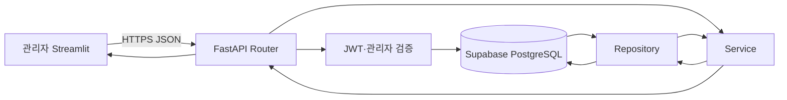

# AI 취업 코치 관리자 백엔드

AI 취업 코치 서비스의 관리자 인증, 사용자 관리, 공지사항, 운영 대시보드, 저장 채용공고와 AI 운영 로그 API를 제공하는 FastAPI 애플리케이션입니다.

> 기준일: 2026-08-12 · Python 3.12 · FastAPI · Supabase PostgreSQL · JWT

## 주요 기능

### 관리자 인증

- `app.user_accounts`의 관리자 계정으로 로그인
- 비밀번호 해시, `role='admin'`, 활성·잠금 상태 검증
- 관리자 Access Token 발급
- 인증 요청마다 현재 계정 상태 재검증

관리자 아이디와 비밀번호는 `.env`에 저장하지 않습니다. DB에 관리자 역할 계정이 있어야 로그인할 수 있습니다.

### 사용자 관리

- 사용자 목록, 로그인 아이디 검색, 역할·활성 상태 필터와 페이지 조회
- 계정·프로필 상세 조회
- 계획·퀘스트·진행률을 포함한 종합 상세 조회
- 사용자별 로드맵 이력 조회
- 사용자별 전체 퀘스트와 활성 계획 진행률 조회
- 사용자 활성 상태 변경
- 일반 사용자와 연관 데이터 영구 삭제
- 관리자 역할 계정 삭제 방지

### 운영 기능

- 공지사항 등록·목록·상세·수정·삭제
- 사용자·온보딩·평가·로드맵·퀘스트 대시보드 집계
- 저장된 채용공고 목록 조회
- AI 로그 목록·상세·KPI API 계층
- 사용자 AI 응답 피드백 조회·등록 API 계층

AI 로그·피드백 API는 `app.ai_logs`, `app.admin_log_summary`, `app.feedback`를 참조합니다. 해당 DB 객체의 생성 migration은 현재 이 폴더에 없으므로 실제 Supabase에 객체가 없으면 `503`이 발생합니다.

## 프로젝트 구조

```text
backend_admin/
├── app/
│   ├── main.py                   # FastAPI 앱과 Router 등록
│   ├── core/                     # JWT, 인증 의존성, Supabase, 응답 유틸리티
│   ├── routers/                  # HTTP 엔드포인트
│   ├── schemas/                  # Pydantic 요청·응답 모델
│   ├── services/                 # 업무 규칙과 오류 변환
│   ├── repositories/             # Supabase 데이터 접근
│   └── exceptions/               # 공통 예외 처리
├── sql/                          # app 스키마 재현·보완 SQL
├── tests/                        # 관리자 API·Service 테스트
├── API_SPEC.md                   # 상세 API 명세
├── .env.example                  # 환경 변수 예시
├── requirements.txt
└── run.sh
```

요청 처리 구조:



## API 요약

- 로컬 Base URL: `http://127.0.0.1:8000`
- 배포 설정 URL: `https://aio-01-p1-team2.onrender.com`
- Swagger: `/docs`
- OpenAPI JSON: `/openapi.json`

관리자 로그인 외 `/api/v1/admin/**` 요청에는 다음 헤더가 필요합니다.

```http
Authorization: Bearer {access_token}
```

| 영역 | Method | Endpoint | 설명 |
|---|---|---|---|
| 인증 | POST | `/api/v1/admin/auth/login` | 관리자 로그인 |
| 인증 | GET | `/api/v1/admin/auth/me` | 현재 관리자 조회 |
| 사용자 | GET | `/api/v1/admin/users` | 목록·검색·필터 |
| 사용자 | GET | `/api/v1/admin/users/by-login-id/{login_id}` | 계정·프로필 상세 |
| 사용자 | GET | `/api/v1/admin/users/by-login-id/{login_id}/overview` | 사용자 종합 상세 |
| 사용자 | GET | `/api/v1/admin/users/by-login-id/{login_id}/roadmaps` | 로드맵 이력 |
| 사용자 | GET | `/api/v1/admin/users/by-login-id/{login_id}/quests` | 퀘스트·진행률 |
| 사용자 | PATCH | `/api/v1/admin/users/{user_id}` | 활성 상태 변경 |
| 사용자 | DELETE | `/api/v1/admin/users/{user_id}` | 사용자 영구 삭제 |
| 공지 | GET/POST | `/api/v1/admin/notices` | 목록·등록 |
| 공지 | GET/PATCH/DELETE | `/api/v1/admin/notices/{notice_id}` | 상세·수정·삭제 |
| 대시보드 | GET | `/api/v1/admin/dashboard?days=7` | 1~90일 운영 지표 |
| 채용공고 | GET | `/api/v1/admin/saved-jobs` | 저장 공고 목록(읽기 전용) |
| AI 로그 | GET | `/api/v1/admin/logs` | 로그 목록·필터 |
| AI 로그 | GET | `/api/v1/admin/logs/summary` | 요청·오류·지연 KPI |
| AI 로그 | GET | `/api/v1/admin/logs/{log_id}` | 로그 상세 |
| 피드백 | GET/POST | `/api/v1/logs/{log_id}/feedback` | 일반 사용자 피드백 |

전체 요청·응답 모델과 오류는 [API_SPEC.md](API_SPEC.md)를 확인하세요.

## 환경 변수

`.env.example`을 복사해 `backend_admin/.env`를 만듭니다.

```env
PYTHON_VERSION=3.12.7
SUPABASE_URL=https://your-project-ref.supabase.co
SUPABASE_ANON_KEY=your-supabase-anon-key
SUPABASE_SERVICE_ROLE_KEY=your-supabase-service-role-key
JWT_SECRET_KEY=<AT_LEAST_32_RANDOM_BYTES>
JWT_ALGORITHM=HS256
JWT_ACCESS_TOKEN_EXPIRE_MINUTES=60
```

- `SUPABASE_SERVICE_ROLE_KEY`와 `JWT_SECRET_KEY`를 Git, 브라우저 코드 또는 로그에 노출하지 않습니다.
- 사용자·관리자 서버가 같은 JWT를 검증하면 Secret, Algorithm과 issuer/audience 설정을 일치시킵니다.
- 운영 환경에서는 충분히 긴 무작위 JWT Secret을 사용합니다.

## 설치와 실행

PowerShell:

```powershell
cd C:\aio-01-p1-team2\backend_admin
python -m venv .venv
.venv\Scripts\Activate.ps1
python -m pip install -r requirements.txt
python -m uvicorn app.main:app --host 0.0.0.0 --port 8000 --reload
```

Bash 또는 Render 실행 방식:

```bash
cd backend_admin
python -m pip install -r requirements.txt
./run.sh
```

서버 실행 후 `http://127.0.0.1:8000/docs`에서 API를 확인합니다.

## 데이터베이스 적용

관리자 SQL 파일:

```text
00_bootstrap.sql
01_user_accounts.sql
02_profiles.sql
03_saved_jobs.sql
04_plans.sql
05_schedule_items.sql
06_ai_results.sql
07_notifications.sql
08_cross_table_constraints.sql
09_runtime_grants.sql
10_profile_assessment_link.sql
11_delete_user_completely.sql
12_admin_dashboard.sql
notices.sql
```

주요 DB 객체:

- `app.user_accounts`, `app.profiles`
- `app.saved_jobs`, `app.plans`, `app.schedule_items`
- `app.ai_results`, `app.notifications`, `app.notices`
- `app.delete_user_completely(uuid)`
- `app.get_admin_dashboard(integer)`

번호가 있는 SQL은 의존 관계에 맞게 순서대로 적용합니다. 파일 존재만으로 원격 Supabase 적용이 보장되지는 않으므로 테이블·FK·인덱스·함수와 실행 권한을 배포 환경에서 확인해야 합니다.

## 테스트

```powershell
cd C:\aio-01-p1-team2\backend_admin
.venv\Scripts\python.exe -m pytest tests -q
.venv\Scripts\python.exe -m compileall -q app
```

2026-08-12 확인 결과:

```text
31 passed, 2 warnings
compileall 통과
```

경고 2건은 Supabase `gotrue`와 Starlette TestClient 관련 deprecation 경고이며 테스트 실패가 아닙니다. 테스트는 외부 Supabase 배포 상태나 전체 프론트엔드 E2E를 보장하지 않습니다.

## 프론트엔드 연동

관리자 프론트엔드는 `frontend_admin`에 있습니다.

```env
BACKEND_ADMIN_URL=http://127.0.0.1:8000/api/v1
BACKEND_USER_URL=http://127.0.0.1:8010/api/v1
```

현재 연결된 화면:

- 관리자 로그인
- 운영 대시보드
- 사용자 목록·상세·로드맵
- 공지 목록·상세
- 저장 공고 목록·상세

## 현재 제한사항

- 공지 등록·수정·삭제와 사용자 상태 변경·삭제 UI는 백엔드 API에 완전히 연결되지 않았습니다.
- 저장 채용공고는 관리자 API에서도 조회 전용입니다.
- AI 로그·KPI·피드백 DB migration과 관리자 로그 시각화 화면이 없습니다.
- 실시간 로그 streaming 또는 polling 기반 자동 갱신은 구현되지 않았습니다.
- `frontend_admin/app_pages/start.py`의 개발용 기본 로그인 값은 운영 배포 전에 제거해야 합니다.
- 원격 Supabase와 Render 배포 E2E는 별도로 검증해야 합니다.

## 관련 문서

- [관리자 API 상세 명세](API_SPEC.md)
- [전체 프로젝트 README](../README.md)
- [최종 프로젝트 문서](../docs/revised/Project_README.md)
- [화면 설계서](../docs/revised/화면설계.md)
- [데이터베이스 설계서](../docs/revised/데이터베이스설계.md)
- [대시보드 구현 결과](../docs/revised/대시보드_구현결과.md)
