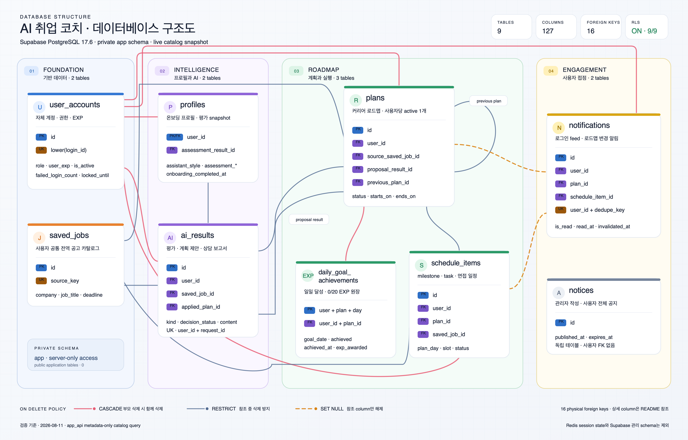
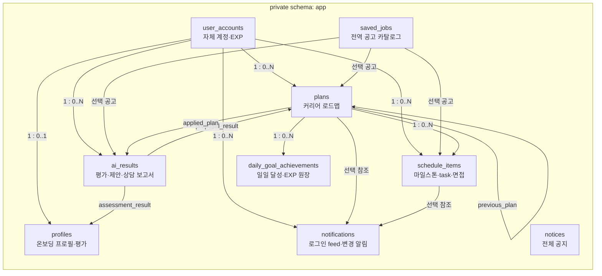
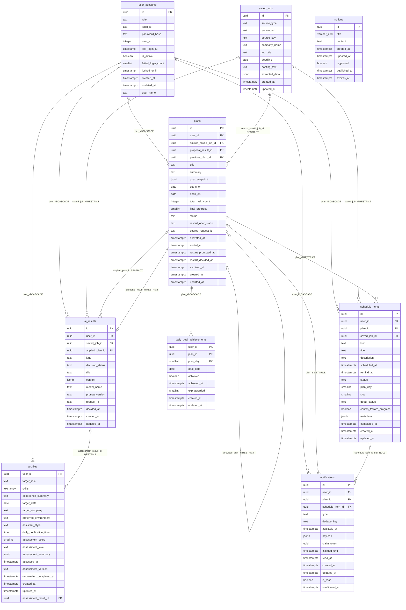

# AI 취업 코치 백엔드 (backend_user)

Gemini `gemini-3.6-flash` 자유대화 온보딩과 사용자 맞춤 취업·커리어 상담을 FastAPI, Redis, Supabase PostgreSQL, Rich 기반 인터랙티브 CLI로 연결하는 사용자 백엔드 서버입니다.

자체 계정 API는 `login_id/login_pw/user_name` 기반 회원가입, 로그인, 현재 계정의 로그인 ID·이름 수정과 영구 삭제를 지원합니다. 회원가입 성공 시 access/refresh token을 즉시 발급합니다.

활성 계획은 날짜별 task를 모두 완료하는 순간 일일 목표를 달성하고 `+20 EXP`를 누적합니다. 완료 task를 되돌려 날짜가 다시 미달성이 되면 `-20 EXP`, 재완료하면 다시 `+20 EXP`가 반영되며 과거·미래 날짜에도 같은 규칙이 적용됩니다.

로그인 직후에는 활성 계획의 KST 오늘 포함 7일 일정을 계획·날짜별로 동기화해 미확인 알림을 보여줍니다. 계획 활성화·수정·종료와 일정 추가·수정·삭제는 PostgreSQL trigger가 원본 변경과 같은 트랜잭션에서 기록하며, 조회만으로는 확인 처리하지 않습니다.

완료된 프로필의 `assistant_style`을 사용하는 코치 상담은 일반 커리어 질문, 최신 DB 공고 추천, 활성 로드맵 일정 조회를 지원합니다. 대화 원문은 Redis에 생성 시점부터 최대 24시간만 보관하고, 활성 상담은 생성 또는 마지막 사용자 입력 접수 후 120초가 지나면 종료합니다. 명시적으로 상담을 종료하면 구조화 보고서만 PostgreSQL `app.ai_results`에 저장합니다.

```bash
curl -X POST https://aio-01-p1-team2-1.onrender.com/api/v1/auth/signup \
  -H 'Content-Type: application/json' \
  -d '{"login_id":"new.user","login_pw":"password123","user_name":"홍길동"}'
```

중복 ID는 `409 LOGIN_ID_ALREADY_EXISTS`, 사라진 계정은 `404 ACCOUNT_NOT_FOUND`, 입력 오류는 `422 VALIDATION_ERROR`, DB/Redis 장애는 `503 SERVICE_UNAVAILABLE`, Gemini 장애는 `502`로 응답합니다.

---

## 빠른 시작

```bash
# 로컬 서버 실행 (기본 bind: 0.0.0.0:8010)
./run.sh

# 호스트/포트 변경
HOST=0.0.0.0 PORT=9000 ./run.sh

# CLI 앱 실행 (서버 실행 후 별도 터미널)
uv run --frozen ai-job-coach-cli
```

배포 기본 주소는 `https://aio-01-p1-team2-1.onrender.com`이고 로컬 기본 백엔드 포트는 `8010`입니다.

로그인/회원가입 성공 후 CLI는 access token을 저장하고 `POST /api/v1/notifications/login-feed`를 `GET /profile`보다 먼저 호출합니다. 다가오는 일정과 최근 로드맵 변경을 표시한 뒤 사용자가 번호로 고른 알림만 확인 처리합니다. 알림 조회·확인 실패는 경고만 표시하며 프로필과 메인 메뉴 진입을 막지 않습니다.

메인 메뉴에서 `11. AI 취업 코치 상담`을 선택하면 상담을 시작할 수 있습니다. 질문을 반복해서 입력하고 `/finish`를 실행하면 구조화 상담 보고서를 저장·출력한 뒤 메인 메뉴로 돌아옵니다.

---

## 데이터베이스 구조

> **실DB 조회 기준:** 2026-08-11, `backend_user/.env`의 `DATABASE_URL`에 `app_api`로 연결해 PostgreSQL catalog만 조회했습니다. 현재 서버는 PostgreSQL `17.6`이며, 애플리케이션 row와 비밀값은 조회하지 않았습니다.

- 실제 애플리케이션 데이터는 private `app` 스키마의 **9개 테이블, 127개 live column**에 저장됩니다. 9개 테이블 모두 RLS가 활성화되어 있습니다.
- `public` 스키마에는 현재 애플리케이션 테이블이 없습니다. `sql/init_products.sql`의 샘플 `public.products`는 실제 DB에 적용되지 않았고 사용자 백엔드 코드에서도 참조하지 않습니다.
- `auth`, `storage`, `realtime`, `vault`, `supabase_migrations` 등은 Supabase 관리 스키마이므로 아래 ERD에서 제외했습니다.
- 상담/온보딩 세션, refresh token, 계획 생성 checkpoint는 Redis에 저장됩니다. `quests`라는 별도 테이블은 없으며 오늘의 퀘스트는 `app.schedule_items`입니다.
- 실제 DB의 모든 FK 16개와 CHECK/PK/UNIQUE를 포함한 108개 제약은 현재 `VALIDATED` 상태입니다.

### 스키마 관계도



[고해상도 PNG](docs/images/database-structure.png) · [확대 가능한 SVG](docs/images/database-structure.svg)



`notices`는 사용자별 FK가 없는 전체 공지 테이블입니다. `saved_jobs`도 사용자별 저장 목록이 아니라 `source_key`로 중복을 제거하는 전역 공고 원본입니다.

### ERD

아래 column/type은 SQL 초안이 아니라 실제 `pg_catalog` 조회 결과입니다. `timestamptz`는 `timestamp with time zone`, `timestamp`는 `timestamp without time zone`, `text_array`는 `text[]`, `varchar_200`은 `character varying(200)`을 뜻합니다.



### 테이블 명세

| 테이블 | 역할 | PK | 주요 UNIQUE 규칙 |
|---|---|---|---|
| `app.user_accounts` | 자체 로그인 계정, 권한, EXP, 잠금 상태 | `id` | `lower(login_id)` |
| `app.profiles` | 1:1 온보딩 프로필과 가장 최근 평가 snapshot | `user_id` | PK가 사용자당 프로필 1개를 보장 |
| `app.saved_jobs` | 모든 사용자가 참조하는 전역 공고 원본 | `id` | `source_key` |
| `app.ai_results` | 프로필 평가, 계획 제안, 문서/면접 결과, 상담 보고서 | `id` | `(user_id, request_id)`, 사용자당 pending 프로필 제안 1개, 세션당 상담 보고서 1개 |
| `app.plans` | 제안으로 생성·활성화되는 커리어 로드맵 | `id` | `(user_id, source_request_id)`, 사용자당 active 계획 1개, proposal 결과당 계획 1개, 거절되지 않은 previous plan당 successor 1개 |
| `app.schedule_items` | 계획의 milestone/task와 독립 면접 일정 | `id` | 진행 task의 `(plan_id, plan_day, slot)` |
| `app.daily_goal_achievements` | 계획·날짜별 달성 여부와 `0/20` EXP 원장 | `(user_id, plan_id, plan_day)` | `(user_id, plan_id, goal_date)` |
| `app.notifications` | 로그인 feed, 로드맵 변경, 종료·면접 알림 | `id` | `(user_id, dedupe_key)` |
| `app.notices` | 사용자 전체에게 노출하는 관리자 공지 | `id` | 없음 |

실DB column의 null/default 구조는 다음과 같습니다. `필수 입력`은 `NOT NULL`이면서 DB 기본값이 없는 column입니다.

| 테이블 | 필수 입력 | `NULL` 허용 | DB 기본값이 있는 `NOT NULL` column |
|---|---|---|---|
| `user_accounts` | `login_id`, `password_hash` | `last_login_at`, `locked_until` | `id`, `role`, `user_exp`, `is_active`, `failed_login_count`, `created_at`, `updated_at`, `user_name` |
| `profiles` | `user_id` | `target_role`, `experience_summary`, `target_date`, `target_company`, `preferred_environment`, `daily_notification_time`, 평가 6개 column, `onboarding_completed_at` | `skills`, `assistant_style`, `created_at`, `updated_at` |
| `saved_jobs` | `source_type`, `source_key`, `company_name`, `job_title`, `posting_text` | `source_url`, `deadline` | `id`, `extracted_data`, `created_at`, `updated_at` |
| `ai_results` | `user_id`, `kind`, `title`, `content`, `model_name`, `prompt_version`, `request_id` | `saved_job_id`, `applied_plan_id`, `decided_at` | `id`, `decision_status`, `created_at`, `updated_at` |
| `plans` | `user_id`, `title`, `starts_on`, `ends_on`, `source_request_id` | `source_saved_job_id`, `proposal_result_id`, `previous_plan_id`, `summary`, `final_progress`, 상태 전이 시각 5개 | `id`, `goal_snapshot`, `total_task_count`, `status`, `restart_offer_status`, `created_at`, `updated_at` |
| `schedule_items` | `user_id`, `kind`, `title` | `plan_id`, `saved_job_id`, `description`, `scheduled_at`, `remind_at`, `plan_day`, `slot`, `completed_at` | `id`, `status`, `detail_status`, `counts_toward_progress`, `metadata`, `created_at`, `updated_at` |
| `daily_goal_achievements` | `user_id`, `plan_id`, `plan_day`, `goal_date` | `achieved_at` | `achieved`, `exp_awarded`, `created_at`, `updated_at` |
| `notifications` | `user_id`, `type`, `dedupe_key` | `plan_id`, `schedule_item_id`, `claim_token`, `claimed_until`, `read_at`, `invalidated_at` | `id`, `available_at`, `payload`, `is_read`, `created_at`, `updated_at` |
| `notices` | `title`, `content` | `expires_at` | `id`, `is_pinned`, `published_at`, `created_at`, `updated_at` |

### FK와 삭제 규칙

복합 FK에 `user_id`를 함께 넣어 다른 사용자의 plan, assessment, schedule을 연결하지 못하게 합니다. 모든 FK의 `ON UPDATE`는 `NO ACTION`입니다.

| 자식 column | 부모 column | `ON DELETE` | 의미 |
|---|---|---|---|
| `profiles.user_id` | `user_accounts.id` | `CASCADE` | 계정 삭제 시 프로필 삭제 |
| `profiles.(user_id, assessment_result_id)` | `ai_results.(user_id, id)` | `RESTRICT` | 같은 사용자의 평가만 연결; deferrable |
| `plans.user_id` | `user_accounts.id` | `CASCADE` | 계정 삭제 시 계획 삭제 |
| `plans.source_saved_job_id` | `saved_jobs.id` | `RESTRICT` | 참조 중인 공고 삭제 방지 |
| `plans.(user_id, previous_plan_id)` | `plans.(user_id, id)` | `RESTRICT` | 같은 사용자의 이전 계획만 연결 |
| `plans.(user_id, proposal_result_id)` | `ai_results.(user_id, id)` | `RESTRICT` | 같은 사용자의 제안만 계획으로 적용; deferrable |
| `schedule_items.user_id` | `user_accounts.id` | `CASCADE` | 계정 삭제 시 일정 삭제 |
| `schedule_items.(user_id, plan_id)` | `plans.(user_id, id)` | `RESTRICT` | 같은 사용자의 계획 일정만 허용 |
| `schedule_items.saved_job_id` | `saved_jobs.id` | `RESTRICT` | 참조 중인 공고 삭제 방지 |
| `ai_results.user_id` | `user_accounts.id` | `CASCADE` | 계정 삭제 시 AI 결과 삭제 |
| `ai_results.saved_job_id` | `saved_jobs.id` | `RESTRICT` | 공고 기반 결과의 원본 보존 |
| `ai_results.(user_id, applied_plan_id)` | `plans.(user_id, id)` | `RESTRICT` | 같은 사용자의 적용 계획만 연결 |
| `notifications.user_id` | `user_accounts.id` | `CASCADE` | 계정 삭제 시 알림 삭제 |
| `notifications.(user_id, plan_id)` | `plans.(user_id, id)` | `SET NULL (plan_id)` | 사용자 ID를 남기고 계획 참조만 해제 |
| `notifications.(user_id, schedule_item_id)` | `schedule_items.(user_id, id)` | `SET NULL (schedule_item_id)` | 사용자 ID를 남기고 일정 참조만 해제 |
| `daily_goal_achievements.(user_id, plan_id)` | `plans.(user_id, id)` | `CASCADE` | 계획 삭제 시 일일 EXP 원장 삭제 |

`plans.proposal_result_id`와 `profiles.assessment_result_id` FK만 `DEFERRABLE INITIALLY IMMEDIATE`입니다. 기본 검사는 statement 종료 시점에 수행되며, 필요한 적용 트랜잭션에서 명시적으로 `DEFERRED`로 바꾸면 transaction 종료 시점까지 검사를 미룰 수 있습니다.

### 주요 CHECK, index, trigger

- 계정은 `user|admin`, 로그인 ID는 소문자 영숫자·`._-` 4~50자, EXP는 0 이상입니다. `lower(login_id)` unique index로 ID 중복을 막습니다.
- 프로필 평가 column은 모두 `NULL`이거나 모두 채워져야 합니다. 온보딩 완료 시 목표 직무, 기술, 경험, 목표일, 선호 환경, 알림 시각과 평가가 필수입니다.
- 계획 상태는 `draft|active|completed|expired|superseded|rejected`이며 날짜 범위, 활성/종료 시각, 최종 진행률, 재시작 상태를 함께 검증합니다. partial unique index가 사용자당 active 계획과 거절되지 않은 previous plan당 successor를 각각 하나로 제한합니다.
- 일정은 `milestone|task|interview`, 상태는 `pending|in_progress|completed|cancelled`입니다. 완료 상태와 `completed_at`, 알림 시각 순서, 진행 task의 day/slot 모양을 CHECK로 묶습니다.
- AI 결과의 `kind`·의사결정 상태·적용 계획을 함께 검증합니다. 프로필 평가/계획 제안/상담 보고서 JSON은 종류별 schema CHECK를 거치며, 상담 보고서는 세션당 하나이고 128 KiB 이하이며 대화 원문·prompt·tool 원문 key를 저장할 수 없습니다.
- 알림은 `(user_id, dedupe_key)`로 중복을 막고 `is_read = (read_at IS NOT NULL)`을 강제합니다. unread/not-invalidated partial index로 로그인 feed 조회 범위를 줄입니다.
- 일일 목표는 `achieved=true`일 때만 `achieved_at`과 `exp_awarded=20`을 허용하고, 미달성 상태는 `0 EXP`만 허용합니다.
- 9개 테이블 모두 `BEFORE UPDATE`의 `app.set_updated_at()` trigger로 `updated_at`을 갱신합니다.
- 계획 변경은 row-level trigger, 일정 변경은 transition table을 쓰는 statement-level trigger가 알림을 생성합니다. FK로 계획·일정 참조가 해제될 때는 기존 ID를 알림 payload에 먼저 보존합니다.
- `app.guard_profile_plan_proposal_lifecycle()`는 pending 제안의 허용된 상태 전이만, `app.guard_career_coach_report_update()`는 완료 상담 보고서의 불변성을 보장합니다.
- 실제 DB에는 이 저장소 SQL에서 생성하는 함수 9개 외에 관리자용 `app.get_admin_dashboard(integer) -> jsonb`가 하나 더 있습니다. 현재 `app_runtime`은 이 함수와 `app.sync_daily_task_notifications(uuid)`만 실행할 수 있습니다.

### RLS와 권한

- 모든 `app` 테이블은 RLS가 켜져 있고 `FORCE ROW LEVEL SECURITY`는 사용하지 않습니다.
- `app_runtime_full_access` 정책은 `notices`를 제외한 8개 테이블에 적용됩니다. `notices`는 `app_runtime_select_notices`로 조회만 허용합니다.
- `app_runtime_full_access`의 조건은 `USING (true) WITH CHECK (true)`입니다. 따라서 이 RLS는 `anon`/`authenticated` 같은 브라우저 역할과 서버 역할의 경계이며, 사용자별 row 격리를 제공하지 않습니다. 사용자 소유권은 JWT `sub`, repository의 `user_id` 조건, 복합 소유권 FK로 검증합니다.
- `app_api`는 로그인 가능한 `app_runtime` 멤버이며 schema/table/function 권한을 상속합니다. superuser나 `BYPASSRLS` 역할은 아닙니다.
- `PUBLIC`, `anon`, `authenticated`에는 `app` schema `USAGE`, 테이블 권한, 현재 함수 실행 권한이 없습니다.
- 실제 DB의 기존 함수는 개별 revoke로 보호되어 있습니다. 다만 `app` schema의 향후 `postgres` 소유 함수에 대한 default `PUBLIC EXECUTE` revoke 항목은 catalog에 없어, 새 함수를 만들 때 `REVOKE EXECUTE ... FROM PUBLIC`을 함께 적용해야 합니다.

### 실DB와 저장소 SQL의 차이

README의 ERD는 아래 차이에서 항상 **실DB**를 기준으로 표기했습니다.

| 항목 | 실DB | 저장소 SQL | 비고 |
|---|---|---|---|
| `user_accounts.last_login_at` | `timestamp without time zone` | `timestamptz` | legacy DB type drift |
| `user_accounts.locked_until` | `timestamp without time zone` | `timestamptz` | legacy DB type drift |
| `notices.title` | `varchar(200)` | `text` + 길이 CHECK | 의미상 최대 길이는 동일 |
| `notices` legacy object | `notices_created_at_idx`와 중복 성격 CHECK 3개가 남아 있음 | 현재 `14_notices.sql`에는 없음 | 기존 데이터 보존형 migration 흔적 |
| `app.get_admin_dashboard(integer)` | 존재 | `backend_user/sql`에 정의 없음 | 실DB에만 존재하는 dashboard용 공유 함수; 생성 출처 미확인 |
| `public.products` | 없음 | `sql/init_products.sql`에만 존재 | 샘플 SQL, 사용자 백엔드 미사용 |

번호가 붙은 `sql/00_bootstrap.sql`~`sql/22_notifications_login_roadmap.sql`이 private schema와 legacy migration을 관리합니다. `app_api`에는 `supabase_migrations.schema_migrations` 조회 권한이 없으므로 migration history 이름은 이번 runtime catalog 조회에서 독립 검증하지 않았습니다.

---

## 로그인 로드맵 알림 API

두 엔드포인트 모두 Bearer JWT가 필요하고 `user_id`를 받지 않습니다. 사용자 ID는 JWT `sub`에서만 결정됩니다.

```text
POST /api/v1/notifications/login-feed
PATCH /api/v1/notifications/{notification_id}/read
```

- feed는 KST 오늘부터 오늘+6일까지 active 계획의 `pending|in_progress` 일정을 날짜별 `daily_tasks.v1`로 동기화합니다.
- 응답은 날짜 오름차순 `upcoming` 최대 7건, 최신순 `changes` 최대 50건, 제한 전 전체 `unread_count`를 반환합니다. 변경 payload는 `roadmap_change.v1`, 계획 종료 payload는 `plan_ended.v1`입니다.
- 반환 대상은 현재 사용자의 미확인·미무효화·도래 알림뿐입니다. 같은 payload 재동기화는 확인 상태를 보존하고, payload가 바뀌거나 무효화된 요약이 다시 활성화되면 미확인으로 다시 엽니다.
- PATCH는 소유 알림만 `is_read=true`로 만들고 최초 `read_at`을 보존해 멱등적입니다. 없거나 타 사용자 소유 ID는 모두 `404 NOTIFICATION_NOT_FOUND`입니다.
- 기존 `interview_reminder`, `check_in`은 `legacy.v1` payload 래퍼로 응답 호환성을 유지합니다.

전체 `NotificationFeed`, `NotificationView`, 세 버전 payload 예시는 [API 명세](docs/API_SPEC.md#post-notificationslogin-feed), CLI 선택·장애 동작은 [CLI 설명서](docs/CLI.md#2-인증과-온보딩)를 참고하세요.

---

## AI 취업 코치 상담 API

세 엔드포인트 모두 Bearer JWT와 클라이언트가 생성한 UUID `request_id`가 필요합니다. `user_id`는 보내지 않으며, 응답은 스트리밍하지 않는 JSON입니다.

```text
POST /api/v1/assistant/sessions
  → POST /api/v1/assistant/sessions/{session_id}/messages  (반복)
  → POST /api/v1/assistant/sessions/{session_id}/finalize
```

- 세션 시작 응답의 `revision=0`을 보관하고, 메시지와 종료 요청마다 현재 값을 `expected_revision`으로 보냅니다. 성공한 메시지 응답의 새 `revision`으로 로컬 값을 교체합니다.
- timeout 또는 network error 재시도에는 같은 `request_id`와 완전히 같은 payload를 사용합니다. 같은 ID를 다른 메시지나 다른 API에 재사용하면 `409 IDEMPOTENCY_KEY_REUSED`입니다.
- `tool_results`의 공고·일정은 요청 시점 DB 사실입니다. 회사명, 직무명, 마감일, 일정 시각은 서버가 렌더링하며 Gemini 코칭과 분리됩니다.
- `friendly`는 공감→근거→행동 제안, `direct`는 거친 반말·인터넷 말투와 가벼운 비속어를 사용한 로스트→근거→즉시 행동 순서를 사용합니다. `direct`도 준비 상태와 행동만 지적하며 차별, 외모·정체성·속성 공격, 위협, 결과 보장은 허용하지 않습니다.
- 사용자당 활성 세션은 최대 6개, 세션당 성공한 사용자 턴은 최대 20개입니다. 활성 세션은 생성 또는 마지막 사용자 입력 접수 후 정확히 120초에 종료되며, 입력을 받을 때마다 이 유휴 기한만 갱신됩니다. 응답의 `expires_at`과 Redis 원문·멱등 데이터의 절대 보관 상한 24시간은 연장되지 않습니다.
- “상담 종료”는 `finalize`를 호출합니다. “새 대화”는 현재 세션 `finalize` 성공 후 새 세션을 생성합니다. `201`과 durable replay의 `200`은 모두 종료 성공입니다.

요청·응답 예시, `tool_results` union, 전체 오류 코드는 [API 명세](docs/API_SPEC.md#ai-취업-코치-상담)를 참고하세요.

### DB 반영

- 이번 상담 유휴 정책 배포는 구버전 backend 인스턴스를 먼저 drain·중지한 뒤 신버전만 트래픽을 받게 전환합니다. 절대 만료 점수를 쓰던 `assistant:v1:*:active`와 120초 유휴 점수를 쓰는 `assistant:v2:*:active`를 혼합 버전에서 동시에 집계하지 않습니다.
- fresh bootstrap에서는 수정된 `sql/06_ai_results.sql`에 보고서 제약이 포함됩니다.
- 기존 DB에는 migration role로 `sql/19_career_coach_report.sql`, `sql/20_private_app_schema.sql`, `sql/21_career_coach_report_forbidden_key_check.sql` 순서로 적용합니다. 공유 runtime 역할인 `app_api`로 실행하면 거부됩니다.
- migration 19는 `career_coach_report` kind, 세션당 보고서 하나의 unique index, 완료 보고서 UPDATE 방지 trigger, 128KiB/금지 키/보고서 상태 CHECK를 추가합니다.
- migration 20은 private `app` 스키마에서 `PUBLIC`, `anon`, `authenticated`의 기존·기본 권한을 제거하되 서버용 role 권한은 변경하지 않습니다.
- migration 21은 PostgreSQL 17에서 정상 보고서가 금지 키 검사 결과 `NULL`로 거부되지 않도록 recursive JSONPath를 교체합니다.
- 알림 fresh bootstrap은 최종 상태가 반영된 `sql/07_notifications.sql`을 사용합니다. 기존 DB에는 관리자 migration role로 재실행 가능한 `sql/22_notifications_login_roadmap.sql`을 명시적으로 적용합니다. migration 22는 `is_read/invalidated_at`, 읽음 일관성 CHECK, partial index, 계획·statement-level 일정 trigger, KST 7일 동기화 함수를 추가하며 `supabase db push`를 사용하지 않습니다.
- `TP_dev`에는 migration 21이 `20260811054026_career_coach_report_forbidden_key_check`로 적용됐고, 교체된 `ai_results_career_coach_report_content_check`가 `VALIDATED` 상태임을 확인했습니다. migration 21은 보고서 내용 CHECK만 교체하며 기존 unique index, 불변성 trigger, runtime 권한은 변경하지 않습니다.
- `TP_dev`에는 migration 22가 `20260811073609_notifications_login_roadmap`으로 적용됐습니다. 알림 제약·인덱스·trigger·함수 권한 catalog와 security advisor를 확인했고, `app_api` 연결의 rollback-only smoke test로 생성·동기화·재오픈·무효화·종료 흐름을 비영속 검증했습니다.

### 장애 로그와 재시도

- PostgreSQL 또는 Redis 예외는 클라이언트에 `503 SERVICE_UNAVAILABLE`, `retryable=true`로 반환합니다. 서버 로그에는 `error_type`, PostgreSQL `sqlstate`·`constraint_name`, HTTP method·path만 기록하고 요청 본문, 대화, 프롬프트, raw 예외 메시지는 기록하지 않습니다.
- 메시지·종료 처리의 전체 응답이 완성되기 전에 실패하면 revision과 대화 상태를 갱신하지 않습니다. 특히 보고서 DB 저장이 실패하면 Redis 원문 세션을 유지합니다.
- `finalize`가 timeout, network error, `503`으로 끝난 경우 클라이언트는 revision을 올리지 않고 동일한 `request_id`, `expected_revision`, payload로 재시도합니다. DB 저장 뒤 응답 또는 Redis 정리만 실패한 경우에도 durable replay가 기존 보고서를 반환합니다.

### 현재 검증 상태

전체 검증은 `GEMINI_TIMEOUT_SECONDS=15 uv run --frozen pytest -q -rs -p no:cacheprovider`로 실행합니다. 별도 DB URL 또는 live Gemini opt-in이 필요한 항목은 해당 설정이 없으면 skip되며, 실제 실행 결과는 배포·핸드오프 시점에 기록합니다. 변경 Python 파일은 Ruff check/format, `compileall`, `git diff --check`로 함께 확인합니다.

---

## 디렉터리 구조

```
backend_user/
├── app/                    # FastAPI 애플리케이션
│   ├── main.py             # 앱 팩토리, lifespan(DB/Redis/Gemini 초기화), 예외 핸들러
│   ├── structured.py       # provider-neutral 구조화 출력 검증 에러
│   ├── api/                # HTTP 라우터, 스키마, 의존성 주입
│   │   ├── dependencies.py # 서비스·리포지토리·토큰 의존성 공급자
│   │   ├── errors.py       # APIErrorEnvelope, UnauthorizedError, ProfileNotFoundError
│   │   ├── router.py       # /api/v1 하위 전체 라우트 통합
│   │   ├── schemas.py      # 회원가입·로그인·온보딩·계획 요청 Pydantic 모델
│   │   └── routes/         # 엔드포인트 라우트 모듈
│   │       ├── auth.py             # /auth — signup, login, 현재 계정 조회·수정·삭제
│   │       ├── assistant.py        # /assistant — 코치 세션, 메시지, 보고서 종료
│   │       ├── notifications.py    # /notifications — 로그인 feed, 명시적 확인
│   │       ├── onboarding.py       # /onboarding — 세션 시작, 메시지, confirm
│   │       ├── plan_proposals.py   # /plan-proposals — 제안 생성·조회·수락·거절
│   │       ├── plans.py            # /plans — 활성 계획 조회, task 상태 변경
│   │       └── profile.py          # /profile — 확정 프로필 조회
│   ├── auth/               # 인증 도메인
│   │   ├── errors.py       # LoginIdAlreadyExistsError
│   │   ├── models.py       # AccountAuthRecord, CurrentUser, CurrentAccount, LoginResult
│   │   ├── passwords.py    # Argon2 해싱/검증 (pwdlib)
│   │   ├── service.py      # AuthService — signup/login/계정 조회·수정·삭제
│   │   ├── stores.py       # RedisRefreshTokenStore — refresh token TTL 저장
│   │   └── tokens.py      # JWT access token 발급/검증
│   ├── coach/              # 취업·커리어 코치 도메인, Redis 상태, DB 보고서
│   │   ├── models.py       # 엄격한 API·세션·tool result·보고서 모델
│   │   ├── service.py      # 라우팅, DB 도구, 코칭, finalize 오케스트레이션
│   │   ├── stores.py       # Redis 절대 TTL, lock, CAS, 멱등성, tombstone
│   │   ├── repository.py   # 일정 조회와 career_coach_report 저장
│   │   └── presentation.py # canonical fact block과 deterministic fallback
│   ├── cli/                # 터미널 CLI 클라이언트
│   │   ├── api.py          # CoachApiClient — HTTP API 래퍼
│   │   ├── app.py          # CLI 메인 — 인터랙티브 플로우, 명령 디스패치
│   │   ├── create_demo_user.py # 데모 사용자 직접 DB 삽입
│   │   └── renderer.py     # RichRenderer — rich 기반 터미널 렌더링
│   ├── core/               # 공통 설정
│   │   ├── config.py       # Settings — DB/Redis/JWT/Gemini/풀 설정
│   │   ├── api_response.py  # 범용 ApiResponse 모델
│   │   ├── chat_config.py  # 레거시 채팅 .env 로더
│   │   ├── password.py     # 레거시 PBKDF2 해싱
│   │   ├── supabase_config.py # 레거시 Supabase 클라이언트
│   │   └── upload_config.py  # 이미지 업로드 상수
│   ├── db/                 # PostgreSQL 영속성 계층
│   │   ├── pool.py         # psycopg AsyncConnectionPool 팩토리
│   │   ├── repositories.py # PsycopgAccountRepository, PsycopgProfileRepository
│   │   └── plan_repository.py # 계획 제안·계획·task·체크포인트 리포지토리
│   ├── gemini/             # Gemini (Google GenAI) 통합
│   │   ├── client.py       # create_genai_client — Gemini 클라이언트 팩토리
│   │   ├── structured.py   # GeminiStructuredClient — 구조화 출력, 재시도, 검증
│   │   ├── adapter.py      # GeminiOnboardingAdapter — 온보딩 대화/평가
│   │   ├── coach_adapter.py # 상담 의도 분류, 코칭, 구조화 보고서 생성
│   │   ├── plan_adapter.py # GeminiProfilePlanAdapter — 계획 outline/task 생성
│   │   ├── rate_limit.py   # RedisGeminiRateLimiter — Lua 스크립트 기반 호출 제한
│   │   └── errors.py       # GeminiError 계층 (502, 429)
│   ├── onboarding/         # 온보딩 대화 도메인
│   │   ├── models.py       # ProfileField, OnboardingState, OnboardingResponse
│   │   ├── service.py      # OnboardingService — 세션·메시지·confirm 오케스트레이션
│   │   stores.py           # RedisOnboardingSessionStore — 분산 락, TTL
│   │   └── flow.py         # OnboardingValidationError
│   ├── notifications/      # 알림 모델, 표시 문구, repository/service
│   ├── plans/              # 커리어 계획 도메인
│   │   ├── models.py       # ProfilePlanOutlineV1, ProfilePlanTasksV1 등
│   │   ├── records.py      # StoredPlanProposal, StoredTaskUpdate
│   │   ├── generation.py   # ProfilePlanGenerator — outline/task 배치 생성
│   │   ├── checkpoints.py  # GenerationCheckpoint — 재개 가능한 생성 상태
│   │   ├── service.py      # PlanProposalService, PlanManagementService
│   │   ├── stores.py       # Redis 체크포인트 스토어 (Lua)
│   │   ├── errors.py       # PlanDomainError 계층
│   │   └── views.py        # PlanProposalView, PlanView 응답 빌더
│   └── profiles/           # 사용자 프로필 도메인
│       └── models.py       # ProfileOnboardingData, ProfileAssessment, ProfileRecord
├── sql/                    # 데이터베이스 스키마 및 마이그레이션 SQL
├── .env                    # 환경 변수 (DB, Redis, Gemini, JWT)
├── pyproject.toml          # 프로젝트 의존성 및 도구 설정
├── requirements.txt        # pip 의존성
├── run.sh                  # 서버 실행 스크립트
├── PLAN.md                 # 프로젝트 계획
└── README.md               # 이 파일
```

---

## 관련 문서

| 문서 | 설명 |
|------|------|
| [docs/API_SPEC.md](docs/API_SPEC.md) | 전체 API 엔드포인트 명세 |
| [docs/BACKEND.md](docs/BACKEND.md) | 백엔드 아키텍처 및 구조 가이드 |
| [docs/CLI.md](docs/CLI.md) | CLI 앱 사용법 |
| [docs/FRONTEND_AUTH_ONBOARDING_HANDOFF.md](docs/FRONTEND_AUTH_ONBOARDING_HANDOFF.md) | 프론트엔드 인증·온보딩 연동 가이드 |
| [docs/supabase/README.md](docs/supabase/README.md) | Supabase 데이터베이스 설정 |
| [docs/supabase/TP_DEV_RUNTIME_CONFIGURATION.md](docs/supabase/TP_DEV_RUNTIME_CONFIGURATION.md) | 개발 환경 런타임 설정 |
| [TESTING.md](TESTING.md) | 테스트 실행법 및 진행 상황 |
| [AI_JOB_COACH_IMPLEMENTATION_PLAN.md](AI_JOB_COACH_IMPLEMENTATION_PLAN.md) | 설계 및 완료 조건 |
| [PLAN.md](PLAN.md) | 프로젝트 계획 |

별도 동의 없이 Git commit을 만들지 않습니다.
