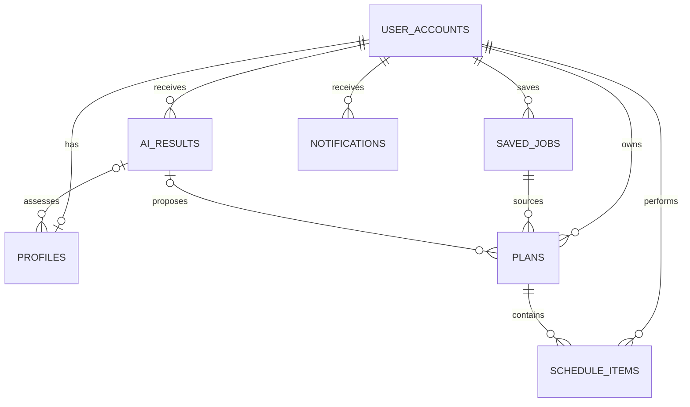
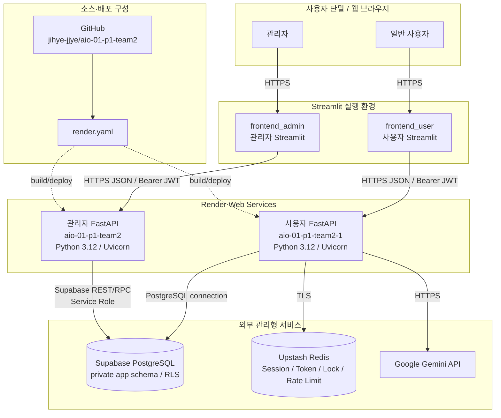
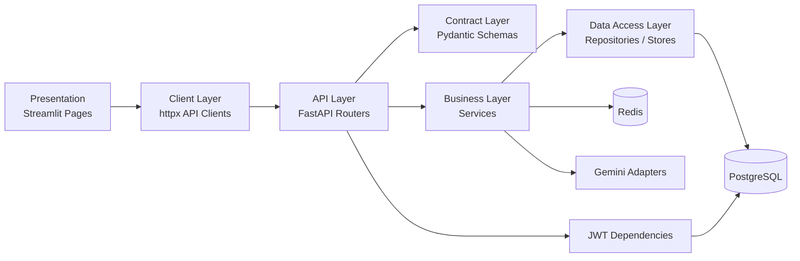
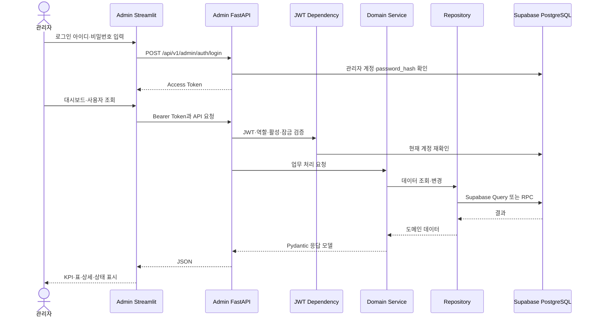
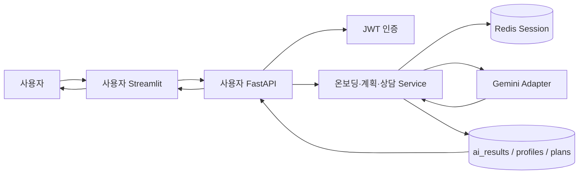

# AI 취업 코치

대화형 온보딩으로 취업 목표와 역량을 파악하고, 개인화 로드맵·오늘의 퀘스트·채용 공고·AI 상담을 제공하는 서비스다. 사용자·관리자 Streamlit 화면, FastAPI 서버, Supabase PostgreSQL, Redis와 Gemini로 구성된다.

## 프로젝트 구성

| 경로              | 역할                                                       |
| ----------------- | ---------------------------------------------------------- |
| `backend_user/`   | 인증, 온보딩, 프로필, 계획·퀘스트, 알림, 공고, AI 상담 API |
| `backend_admin/`  | 관리자 인증, 사용자·공지·대시보드·공고·AI 로그 API         |
| `frontend_user/`  | 사용자 Streamlit 애플리케이션                              |
| `frontend_admin/` | 관리자 Streamlit 콘솔                                      |
| `docs/`           | API 연동, 설계, 계획과 수정 문서                           |
| `render.yaml`     | 사용자·관리자 백엔드 Render 배포 설정                      |

## 현재 관리자 기능

### 백엔드

- DB 계정 기반 관리자 로그인과 JWT 발급
- 현재 관리자 조회 및 역할·활성·잠금 검증
- 사용자 목록·검색·역할·상태 필터·페이지 조회
- 계정·프로필 상세와 종합 상세 조회
- 사용자별 로드맵 이력, 퀘스트와 진행률 조회
- 사용자 활성 상태 변경과 일반 사용자 영구 삭제
- 공지사항 등록·목록·상세·수정·삭제
- 사용자·온보딩·평가·로드맵·퀘스트 관리자 대시보드
- 저장된 채용 공고 목록 조회
- AI 로그 목록·상세·KPI 및 사용자 피드백 코드

### 프론트엔드

- 관리자 로그인과 Session State 기반 접근 제어
- 기간별 KPI 대시보드와 가입자 추이·최근 사용자
- 사용자 목록·상세·프로필·퀘스트·접속 기록
- 사용자별 로드맵 조회
- 공지 목록·상세 조회
- 저장 채용공고 목록·상세 조회
- 사이드바 내비게이션과 로그아웃

## 사용자 기능

- 회원가입·로그인·내 정보 수정·탈퇴 및 JWT 인증
- Gemini 대화형 온보딩과 취업 준비도 평가
- 사용자 프로필 조회
- 로드맵 제안·조회·수락·거절과 계획 이력
- 오늘의 퀘스트 상태와 진행률·EXP 관리
- 저장·추천 채용 공고 조회
- 알림 동기화와 읽음 처리
- 사용자 공지 조회
- Redis 세션 기반 AI 취업 상담

## 기술 스택

| 구분       | 기술                                                   |
| ---------- | ------------------------------------------------------ |
| Frontend   | Python, Streamlit, httpx, pandas, Altair·matplotlib    |
| Backend    | Python 3.12, FastAPI, Pydantic, Uvicorn                |
| Data       | Supabase PostgreSQL, psycopg, Upstash Redis            |
| AI         | Google Gemini / GenAI SDK                              |
| Auth       | JWT access·refresh token, Argon2/PBKDF2 관련 구현, RLS |
| Test       | pytest, pytest-asyncio                                 |
| Deployment | Render(백엔드 2개), 프론트엔드는 로컬 또는 별도 Streamlit 배포 필요 |

## 환경 변수

각 서비스의 `.env.example`을 복사해 실제 `.env`를 만든다. 비밀값은 Git에 커밋하지 않는다.

관리자 백엔드 주요 값:

```env
SUPABASE_URL=https://your-project-ref.supabase.co
SUPABASE_ANON_KEY=your-supabase-anon-key
SUPABASE_SERVICE_ROLE_KEY=your-service-role-key
JWT_SECRET_KEY=<AT_LEAST_32_RANDOM_BYTES>
JWT_ALGORITHM=HS256
JWT_ACCESS_TOKEN_EXPIRE_MINUTES=60
```

관리자 로그인 아이디와 비밀번호는 `.env`가 아니라 `app.user_accounts`의 관리자 계정으로 관리한다.

## 로컬 실행

관리자 백엔드:

```powershell
cd backend_admin
python -m venv .venv
.venv\Scripts\Activate.ps1
pip install -r requirements.txt
uvicorn app.main:app --reload --port 8000
```

관리자 프론트엔드:

```powershell
cd frontend_admin
pip install -r requirements.txt
$env:BACKEND_USER_URL="http://127.0.0.1:8010/api/v1"
$env:BACKEND_ADMIN_URL="http://127.0.0.1:8000/api/v1"
python -m streamlit run app.py --server.port 8502
```

- 관리자 Swagger: `http://127.0.0.1:8000/docs`
- 사용자 Swagger: `http://127.0.0.1:8010/docs`

## 배포 주소

| 서비스     | 주소                                     |
| ---------- | ---------------------------------------- |
| 사용자 API | `https://aio-01-p1-team2-1.onrender.com` |
| 관리자 API | `https://aio-01-p1-team2.onrender.com`   |

실제 배포 상태와 환경 변수는 `render.yaml` 및 `docs/FRONTEND_BACKEND_INTEGRATION.md`를 확인한다.

## 테스트 확인

2026-08-12 현재 관리자 백엔드에서 다음을 확인했다.

```text
pytest backend_admin/tests: 31 passed
Python compileall: 통과
```

경고 2건은 Supabase `gotrue`와 Starlette TestClient 의존성의 deprecation 경고이며 테스트 실패는 아니다. 이번 점검에서는 외부 Supabase·Redis·Gemini를 사용하는 전체 E2E와 배포 서버 호출은 수행하지 않았다.

## 문서

- 관리자 상세 API: `backend_admin/API_SPEC.md`
- 사용자 상세 API: `backend_user/docs/API_SPEC.md`
- 프론트–백엔드 연동: `docs/FRONTEND_BACKEND_INTEGRATION.md`
- 최종 산출물 폴더: `docs/revised/`
- 대시보드 구현 결과: `docs/revised/대시보드_구현결과.md`

## 알려진 제한사항

- 관리자 AI 로그·피드백 코드는 DB 객체가 실제 Supabase에 있어야 동작한다. 해당 생성 SQL은 현재 관리자 SQL 폴더에 없다.
- 관리자 프론트의 일부 변경·삭제 버튼은 API와 아직 연결되지 않았다.
- 로그인 화면의 개발용 기본 자격 증명 값은 운영 배포 전에 제거해야 한다.
- SQL 파일이 저장소에 있어도 원격 Supabase 적용 여부는 별도로 검증해야 한다.
- 현재 체크아웃 브랜치는 `main`이 아니라 `BO`이며 `origin/BO`와 일치한다.
- 프로젝트 진행 가이드의 실시간 AI 로그 대시보드는 아직 end-to-end 미완성이다. 현재 운영 대시보드와 로그 목표 대시보드를 구분해서 확인해야 한다.

## 프로젝트 진행 가이드 산출물 대응

| 필수 산출물          | 현재 문서                     | 상태                                                |
| -------------------- | ----------------------------- | --------------------------------------------------- |
| API 설계 문서        | `API명세서.md`         | 구현 명세·목표 표준 오류와 차이 포함                |
| 화면 설계서          | `화면설계.md`          | 와이어프레임·디자인 시스템·액션 표 포함             |
| 데이터베이스 설계서  | `데이터베이스설계.md`  | 논리·물리 ERD·컬럼 사전·정규화 포함                 |
| 대시보드 구현 결과물 | `대시보드_구현결과.md` | 운영 대시보드 결과와 로그 대시보드 미완성 범위 포함 |

## 테이블 정의

서비스 데이터는 Supabase PostgreSQL의 private `app` 스키마를 중심으로 관리한다. 인증 정보, 사용자 취업 정보, 공고, 계획, 일정과 AI 결과를 서로 분리하고 FK로 연결한다.

| 테이블                        | 주요 컬럼                                                                                                    | 관계                                              | 업무 목적                                           |
| ----------------------------- | ------------------------------------------------------------------------------------------------------------ | ------------------------------------------------- | --------------------------------------------------- |
| `app.user_accounts`           | `id`, `login_id`, `password_hash`, `role`, `user_exp`, `is_active`, `last_login_at`                          | 사용자 도메인의 기준 PK                           | 사용자·관리자 인증, 권한, 활성·잠금 상태와 EXP 관리 |
| `app.profiles`                | `user_id`, `target_role`, `skills`, `target_date`, `assessment_score`, `assessment_level`                    | `user_id` → `user_accounts.id`, 사용자당 최대 1건 | 취업 목표, 역량, 환경, 온보딩·평가 결과 관리        |
| `app.saved_jobs`              | `id`, `user_id`, `source_type`, `company_name`, `job_title`, `deadline`, `extracted_data`                    | 사용자 1:N 공고                                   | URL·붙여넣기 기반 저장 채용공고 관리                |
| `app.plans`                   | `id`, `user_id`, `source_saved_job_id`, `proposal_result_id`, `previous_plan_id`, `status`, `final_progress` | 사용자·공고·AI 결과·이전 계획 참조                | AI가 제안하고 사용자가 결정한 로드맵과 이력 관리    |
| `app.schedule_items`          | `id`, `user_id`, `plan_id`, `saved_job_id`, `kind`, `status`, `scheduled_at`, `counts_toward_progress`       | 사용자·계획·공고 참조                             | 로드맵 퀘스트, 면접과 독립 일정 및 진행률 관리      |
| `app.ai_results`              | `id`, `user_id`, `saved_job_id`, `applied_plan_id`, `kind`, `decision_status`, `content`                     | 사용자·공고·계획 참조                             | 프로필 평가, 계획 제안, 문서·면접 등 AI 결과 보존   |
| `app.notifications`           | `id`, `user_id`, `plan_id`, `schedule_item_id`, `type`, `available_at`, `read_at`                            | 사용자·계획·일정 참조                             | 일일 퀘스트, 계획 종료, 면접과 점검 알림 관리       |
| `app.notices`                 | `id`, `title`, `content`, `created_at`, `updated_at`                                                         | 독립 테이블                                       | 관리자가 등록하고 사용자가 조회하는 공지 관리       |
| `app.daily_goal_achievements` | 사용자·목표일 식별값, EXP 반영 정보                                                                          | 사용자 참조                                       | 일일 목표 달성과 `+20 EXP`의 중복 지급 방지         |

핵심 관계:



DB 무결성은 PK·FK·UNIQUE·CHECK, `updated_at` trigger, RLS와 runtime 권한으로 보호한다. 관리자 대시보드는 `app.get_admin_dashboard(days)` RPC로 집계한다. 관리자 로그 코드가 참조하는 `app.ai_logs`, `app.admin_log_summary`, `app.feedback`는 현재 관리자 SQL 폴더에 생성 migration이 없으므로 실제 Supabase 존재 여부를 별도로 확인해야 한다.

## 업무 정의

### 서비스 목적

AI 취업 코치는 사용자의 취업 목표와 현재 역량을 분석해 실행 가능한 로드맵과 일일 퀘스트를 제공하고, 채용공고 탐색과 AI 취업 상담을 지원한다. 관리자는 사용자·계획·퀘스트·공지·공고와 서비스 운영 지표를 조회하고 관리한다.

### 사용자 업무

| 업무           | 입력                               | 처리                                    | 출력                    |
| -------------- | ---------------------------------- | --------------------------------------- | ----------------------- |
| 회원 관리      | 로그인 아이디, 비밀번호, 계정 정보 | 계정 생성·인증·수정·탈퇴, JWT 발급      | 사용자 세션과 내 정보   |
| AI 온보딩      | 목표 직무, 기술, 경험, 희망 조건   | Gemini 대화, 프로필 추출, 준비도 평가   | 프로필과 역량 평가 결과 |
| 로드맵 관리    | 프로필, 선택 공고, 사용자 결정     | AI 계획 제안, 수락·거절, 활성 계획 전환 | 기간별 취업 준비 계획   |
| 퀘스트 수행    | 일정 상태 변경                     | 완료율 계산, 일일 목표 판정, EXP 반영   | 오늘의 할 일과 진행률   |
| 채용공고 활용  | URL·본문 또는 검색 조건            | 공고 저장·구조화·추천                   | 공고 목록과 맞춤 추천   |
| AI 취업 상담   | 상담 메시지                        | Redis 세션 유지, Gemini 응답 생성       | 상담 답변과 보고서      |
| 알림·공지 확인 | 로그인·조회·읽음 액션              | 일정 알림 동기화, 읽음 처리             | 개인 알림과 서비스 공지 |
| AI 피드백      | 점수 1~5, 의견                     | 로그와 사용자 확인 후 저장              | 저장된 평가 정보        |

### 관리자 업무

| 업무             | 처리 범위                                            | 현재 상태                                |
| ---------------- | ---------------------------------------------------- | ---------------------------------------- |
| 관리자 인증      | DB 관리자 계정 검증, JWT 발급, 역할·활성·잠금 재검증 | 백엔드·로그인 화면 구현                  |
| 사용자 관리      | 목록·검색·필터·상세·활성 상태 변경·영구 삭제         | API 구현, 변경·삭제 UI 일부 미연동       |
| 사용자 현황 조회 | 프로필, 로드맵, 퀘스트 진행률, 최근 접속             | API·주요 조회 화면 구현                  |
| 공지 관리        | 등록·조회·수정·삭제                                  | API 구현, 프론트는 목록·상세 중심        |
| 채용공고 관리    | 저장 공고 목록·상세 조회                             | 읽기 전용 구현                           |
| 운영 대시보드    | 사용자·온보딩·평가·로드맵·퀘스트 KPI                 | API·RPC·Streamlit 화면 구현              |
| AI 로그 관리     | 로그 필터·상세·오류율·평균 지연 조회                 | 백엔드 계층 일부, DB migration·UI 미완성 |
| 피드백 분석      | 점수·의견을 모델·프롬프트 개선에 활용                | 목표 흐름 정의, 분석 화면 미구현         |

### 핵심 업무 규칙

- 관리 API는 관리자 Access Token 없이는 호출할 수 없다.
- 관리자 로그인은 `.env`의 고정 계정이 아니라 `user_accounts.role='admin'`인 활성 계정을 사용한다.
- 관리자 역할 계정은 사용자 삭제 API로 삭제할 수 없다.
- 사용자당 활성 계획은 하나만 허용하며 이전 계획은 이력으로 보존한다.
- 진행률은 진행률 반영 대상이면서 취소되지 않은 퀘스트를 기준으로 계산한다.
- 비밀번호 평문, JWT Secret, Supabase Service Role Key는 저장소와 화면에 노출하지 않는다.
- 공지 제목은 최대 200자, 내용은 최대 20,000자다.
- 저장 공고 관리자 기능은 현재 조회 전용이다.

## 시스템 구성도(물리적으로)

현재 저장소와 `render.yaml`을 기준으로 한 물리 배치 구조다.



| 물리 구성 요소       | 주소·실행 위치                                  | 역할                          |
| -------------------- | ----------------------------------------------- | ----------------------------- |
| 사용자 API           | `https://aio-01-p1-team2-1.onrender.com`        | 사용자 도메인 FastAPI         |
| 관리자 API           | `https://aio-01-p1-team2.onrender.com`          | 관리자 도메인 FastAPI         |
| 사용자·관리자 프론트 | 로컬 또는 별도 Streamlit 배포                   | 브라우저 UI와 API 호출        |
| Supabase             | 환경 변수 `SUPABASE_URL`/DB 연결로 지정         | PostgreSQL 데이터와 RPC       |
| Upstash Redis        | `UPSTASH_REDIS_URL`                             | 사용자 세션·Token·동시성·제한 |
| Gemini               | `GEMINI_API_KEY`, `GEMINI_MODEL`                | 온보딩·계획·추천·상담 AI      |
| GitHub               | `https://github.com/jihye-jjye/aio-01-p1-team2` | 소스 형상 관리                |

프론트엔드의 실제 공개 Streamlit URL은 현재 저장소 환경 예시에 확정값이 없으므로 구성도에는 특정 주소를 기재하지 않았다.

## 시스템 아키텍처 기술(구조도)

### 논리 계층 구조



### 관리자 요청 흐름



### 사용자 AI 업무 흐름



### 구조적 특징

- 사용자 서비스와 관리자 서비스를 별도 FastAPI 프로세스로 분리해 책임과 배포 단위를 구분한다.
- 프론트엔드는 DB에 직접 접근하지 않고 역할에 맞는 FastAPI만 호출한다.
- Router는 HTTP 계약, Service는 업무 규칙, Repository·Store는 저장소 접근을 담당한다.
- Pydantic 모델로 요청·응답과 중첩 데이터 구조를 검증한다.
- 관리자 대시보드는 여러 테이블 집계를 DB RPC 한 번으로 조회해 네트워크 왕복과 집계 불일치를 줄인다.
- 사용자 AI 세션은 Redis에, 확정된 프로필·계획·AI 결과는 PostgreSQL에 저장한다.
- JWT, RLS, 제한된 runtime grant와 Service Role 분리를 통해 접근 권한을 통제한다.
- 외부 저장소·Gemini 장애는 API 오류로 변환하고 프론트에서는 오류·빈 데이터 상태로 표현한다.

### 현재 아키텍처 제한사항

- 프로젝트 가이드가 요구하는 실시간 AI 로그 스트리밍 경로는 아직 구현되지 않았다.
- 관리자 로그 Repository가 기대하는 `ai_logs`, `admin_log_summary`, `feedback` migration이 저장소에 없다.
- 관리자 프론트의 공지 변경, 사용자 상태 변경·삭제와 AI 로그 화면은 완전히 연결되지 않았다.
- 프론트엔드 배포 정보와 전체 배포 E2E 결과는 최종 제출 전에 별도로 검증해야 한다.
