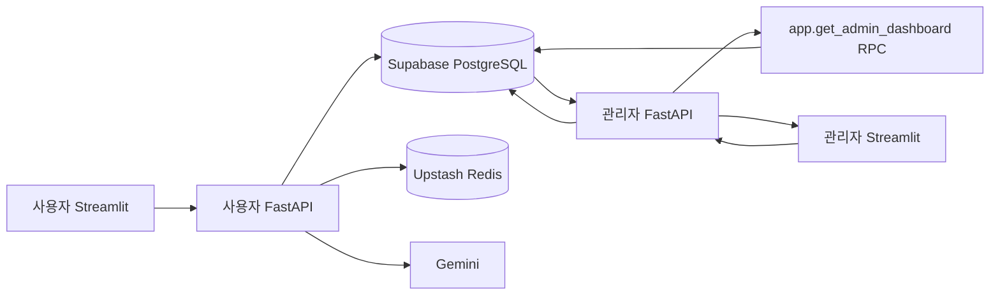
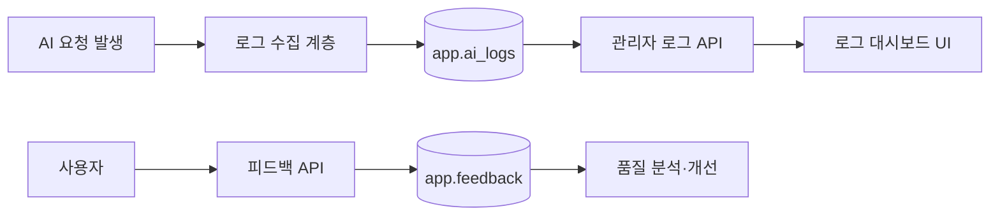

# AI 취업 코치 대시보드 구현 결과물

## 1. 실행 정보

| 항목                     | 내용                                                |
| ------------------------ | --------------------------------------------------- |
| 관리자 API 배포 설정 URL | `https://aio-01-p1-team2.onrender.com`              |
| 관리자 Swagger 후보 URL  | `https://aio-01-p1-team2.onrender.com/docs`         |
| 사용자 API 배포 설정 URL | `https://aio-01-p1-team2-1.onrender.com`            |
| 사용자 Swagger 후보 URL  | `https://aio-01-p1-team2-1.onrender.com/docs`       |
| 로컬 관리자 API          | `http://127.0.0.1:8000`                             |
| 로컬 관리자 화면         | `http://localhost:8502` 권장                        |
| 저장소 URL               | 로컬 Git 설정만으로 제출용 공개 URL을 확정하지 않음 |
| 테스트 계정              | 문서에 실제 계정·비밀번호를 기록하지 않음           |
| Backend                  | Python 3.12, FastAPI, Pydantic, Uvicorn             |
| Frontend                 | Streamlit, httpx, pandas, Altair                    |
| Database                 | Supabase PostgreSQL, private `app` schema           |
| AI·Session               | Gemini, Upstash Redis(사용자 서비스)                |

위 배포 URL은 `render.yaml`과 저장소 README 설정에서 확인한 값이다. 이번 문서 작업에서는 외부 배포 서버에 직접 접속해 동작을 재검증하지 않았으므로 “배포 검증 완료”로 간주하지 않는다.

## 2. 통합 아키텍처



로그 목표 흐름:



두 번째 흐름은 API Repository 일부만 존재하고 DB migration과 관리자 로그 UI가 없어 현재 end-to-end로 완성되지 않았다.

## 3. 현재 구현된 운영 대시보드

관리자 화면 `frontend_admin/app_pages/dashboard.py`는 `GET /api/v1/admin/dashboard?days={1..90}`를 호출한다. 관리자 백엔드는 `app.get_admin_dashboard(days)` RPC 결과를 중첩 Pydantic 모델로 검증해 반환한다.

구현 지표:

- 전체·활성·비활성 사용자와 기간 내 신규 가입자
- 프로필 수, 온보딩 완료·미완료와 완료율
- 역량 평가 사용자, 평균 점수와 beginner/intermediate/advanced 분포
- 계획 보유 사용자, 활성·완료·만료 계획과 상태 분포
- 전체·완료·진행·대기 퀘스트와 완료율
- 오늘 일정·오늘 완료·지연·면접 일정
- 일별 가입자 추이
- 최근 가입 사용자 5명

화면 상태:

- 기간 입력: 1~90일
- API 오류: `st.error()` 표시
- 가입 추이 없음: 빈 데이터 안내
- 최근 가입자 없음: 빈 데이터 안내
- KPI 카드·차트·표 시각화

## 4. AI 로그·피드백 구현 상태

| 기능                   | 백엔드 코드 |      DB migration |          관리자 UI | 판정   |
| ---------------------- | ----------: | ----------------: | -----------------: | ------ |
| 로그 수집·생성         | Schema 일부 |              없음 |               없음 | 미완성 |
| 로그 목록·필터         |        있음 |    `ai_logs` 없음 |               없음 | 미완성 |
| 로그 상세              |        있음 |    `ai_logs` 없음 |               없음 | 미완성 |
| 요청량·오류율·지연 KPI |        있음 | summary view 없음 |               없음 | 미완성 |
| 사용자 피드백 저장     |        있음 |   `feedback` 없음 | 사용자 전용 호출만 | 미완성 |
| 실시간 전송·자동 갱신  |        없음 |                 - |               없음 | 미구현 |

따라서 가이드의 “로그 수집·조회·시각화와 피드백 저장을 배포 환경에서 시연” 완료 기준은 현재 충족하지 않는다.

## 5. 검증 결과

2026-08-12 로컬 관리자 백엔드 점검:

```text
pytest backend_admin/tests -q
31 passed, 2 warnings

python -m compileall -q app
통과
```

테스트가 포함하는 주요 범위:

- 관리자 인증
- 관리자 대시보드
- 저장된 공고 조회
- 사용자 종합 상세·로드맵·퀘스트

경고는 Supabase `gotrue`와 Starlette TestClient 의존성 deprecation 경고다. 외부 DB·배포 브라우저 E2E, 로그 migration, 실시간 갱신은 이번 결과에 포함되지 않는다.

## 6. 현재 시연 가능한 순서

1. 관리자 계정으로 로그인한다.
2. 대시보드에서 조회 기간을 1~90일 사이로 변경한다.
3. 사용자·온보딩·평가 KPI를 확인한다.
4. 일별 가입자 추이와 빈 데이터 안내를 확인한다.
5. 로드맵·퀘스트 지표와 최근 가입자 표를 확인한다.
6. 사용자 관리에서 계정 상세, 프로필, 퀘스트와 접속 기록을 확인한다.
7. 로드맵 관리에서 로그인 아이디로 계획 이력을 조회한다.
8. 공지사항과 저장 채용공고의 목록·상세를 확인한다.

## 7. 가이드 충족을 위한 목표 시연 순서

1. 정상·WARN·ERROR AI 로그를 생성해 `app.ai_logs`에 저장한다.
2. 로그 대시보드를 열어 신규 로그의 자동 반영을 확인한다.
3. 기간·레벨·엔드포인트 필터를 적용한다.
4. ERROR 행을 선택해 모델·상태 코드·지연·메시지를 확인한다.
5. 사용자가 AI 답변에 1~5점과 의견을 등록한다.
6. 관리자 화면에서 피드백 분포와 낮은 점수 응답을 확인한다.
7. 빈 데이터, 401, 403, 503 상태와 재시도를 시연한다.

## 8. 피드백 활용 흐름

```text
AI 답변 생성
  → 로그 ID와 사용자 ID 연결
  → 사용자가 score·comment 저장
  → 관리자/분석 작업이 모델·프롬프트 버전별 점수 집계
  → 저점수·오류 응답 원인 분류
  → 프롬프트·모델·timeout 정책 개선
  → 개선 전후 평균 점수·오류율·지연 비교
```

현재는 저장 API 계층만 있고 재현 가능한 피드백 테이블과 분석 UI가 없어 이 흐름은 목표 설계다.

## 9. 오류·빈 데이터 확인표

| 상태                  | 현재 화면         | 추가 작업              |
| --------------------- | ----------------- | ---------------------- |
| 대시보드 빈 가입 추이 | 안내 메시지 있음  | 완료                   |
| 최근 사용자 없음      | 안내 메시지 있음  | 완료                   |
| 관리자 API 실패       | `st.error()` 있음 | 재시도 버튼 추가       |
| 로그인 입력 누락      | 경고 있음         | 완료                   |
| 401·Token 만료        | 일반 오류 가능    | 세션 정리 후 자동 이동 |
| 403 비활성·잠금       | 백엔드 처리       | 전용 안내 화면         |
| 로그 없음             | 로그 화면 없음    | 빈 로그 화면 구현      |
| 로그 DB 객체 없음     | 503 가능          | migration 추가         |

## 10. 증빙 자료 상태

| 증빙               | 상태                      |
| ------------------ | ------------------------- |
| 소스 코드          | 저장소에 존재             |
| 단위 테스트 결과   | 31 passed 기록            |
| 운영 대시보드 화면 | Streamlit 소스 존재       |
| 실제 화면 캡처     | 아직 문서에 첨부하지 않음 |
| 시연 영상·GIF      | 없음                      |
| 배포 E2E 기록      | 이번 점검에서 없음        |
| 테스트 계정        | 보안상 문서 미기재        |

최종 제출 전 실제 배포 화면 캡처, 실행 영상 또는 GIF, 배포 Swagger 응답, 허용된 테스트 계정 전달 방식과 테스트 일시를 추가해야 한다.

## 11. 최종 판정

현재 저장소는 일반 관리자 운영 대시보드와 관련 API·테스트를 갖추고 있다. 그러나 프로젝트 진행 가이드가 핵심으로 정한 실시간 AI 로그 수집·저장·필터·상세·시각화와 사용자 피드백 분석은 end-to-end로 완성되지 않았다. 이 문서는 구현된 결과와 미완성 범위를 함께 기록한 중간 산출물이며, 남은 기능 구현과 배포 증빙이 추가되어야 최종 완료 산출물이 된다.
