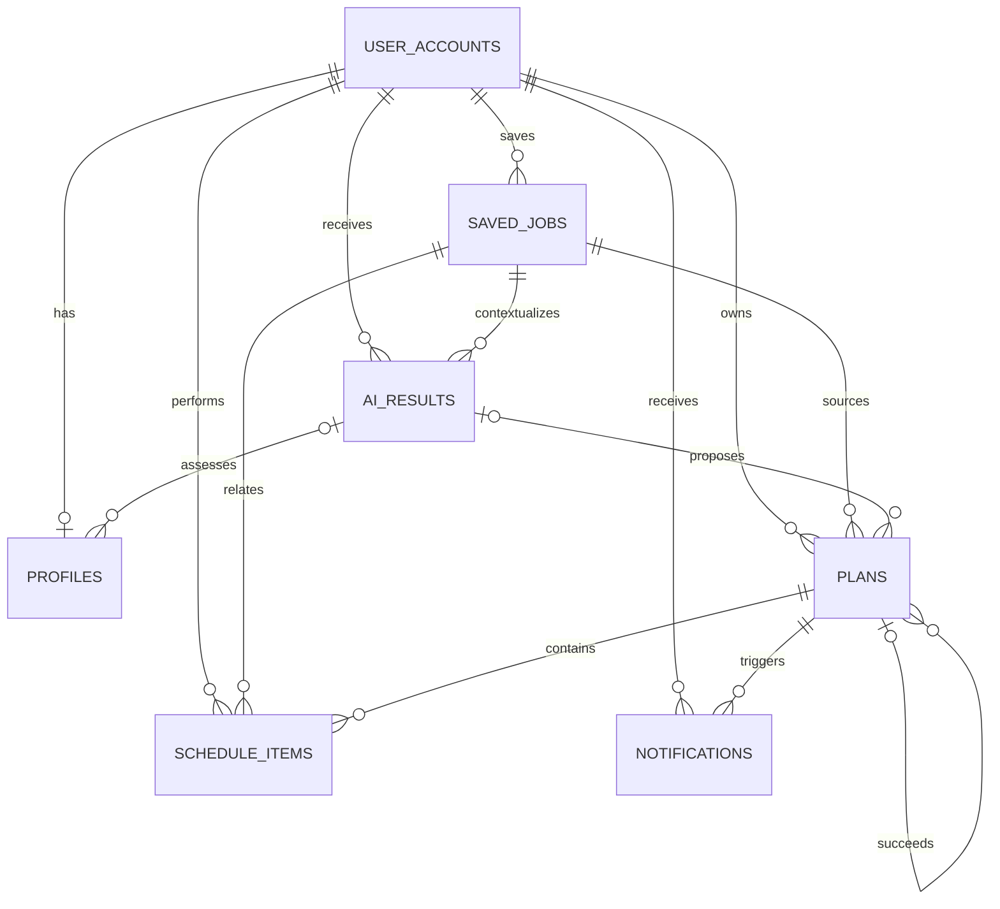

# AI 취업 코치 데이터베이스 설계서

## 1. 핵심 테이블

| 테이블                        | PK          | 역할                                          |
| ----------------------------- | ----------- | --------------------------------------------- |
| `app.user_accounts`           | `id`        | 로그인 계정, 역할, EXP, 활성·잠금 상태        |
| `app.profiles`                | `user_id`   | 목표 직무, 기술, 환경, 역량 평가, 온보딩 결과 |
| `app.saved_jobs`              | `id`        | URL 또는 붙여넣기로 저장된 채용 공고          |
| `app.plans`                   | `id`        | 사용자 로드맵과 상태·최종 진행률              |
| `app.schedule_items`          | `id`        | 계획 퀘스트, 면접과 기타 일정                 |
| `app.ai_results`              | `id`        | 온보딩·평가·계획·추천·상담 AI 결과            |
| `app.notifications`           | `id`        | 계획·일정 기반 사용자 알림                    |
| `app.notices`                 | `id`        | 관리자 공지사항                               |
| `app.daily_goal_achievements` | 복합/식별키 | 사용자 일일 목표 달성과 EXP 중복 방지         |

`daily_goal_achievements` 및 후속 사용자 기능은 `backend_user/sql`에 포함되며, 관리자 SQL 세트에는 포함되지 않는다.

## 2. 논리 관계

```text
user_accounts 1 ── 0..1 profiles
user_accounts 1 ── N saved_jobs
user_accounts 1 ── N plans
user_accounts 1 ── N schedule_items
user_accounts 1 ── N ai_results
user_accounts 1 ── N notifications

saved_jobs 1 ── N plans
saved_jobs 1 ── N schedule_items
saved_jobs 1 ── N ai_results
plans      1 ── N schedule_items
plans      1 ── N notifications
plans      1 ── N plans(previous_plan_id)
ai_results 1 ── N plans(proposal_result_id)
ai_results 1 ── N profiles(assessment_result_id)
```

`notices`는 현재 다른 도메인 테이블과 직접 FK 관계가 없다.

## 3. 주요 컬럼 요약

### 3.1 `app.user_accounts`

`id`, `login_id`, `password_hash`, `role`, `user_exp`, `last_login_at`, `is_active`, `failed_login_count`, `locked_until`, `created_at`, `updated_at`.

- `login_id`는 로그인 식별자이며 중복을 허용하지 않는다.
- `role`은 일반 사용자와 관리자를 구분한다.
- `password_hash`만 저장하고 평문 비밀번호는 저장하지 않는다.
- 관리자 로그인과 모든 관리자 권한 검사의 기준 테이블이다.

### 3.2 `app.profiles`

목표 직무·기술·경험·목표일·목표 회사·선호 환경·AI 응답 스타일·알림 시각과 역량 평가 결과를 저장한다. `user_id`가 PK이자 `user_accounts.id` FK이므로 사용자당 프로필은 최대 한 건이다.

### 3.3 `app.saved_jobs`

`user_id`, `source_type`, `source_url`, `source_key`, `company_name`, `job_title`, `deadline`, `posting_text`, `extracted_data`, 생성·수정 시각을 저장한다.

- `source_type`: `url` 또는 `pasted_text`
- `extracted_data`: JSON object
- 마감일 조회 인덱스가 있다.

### 3.4 `app.plans`

사용자 로드맵의 목표 스냅샷, 기간, 총 작업 수, 최종 진행률, 상태와 활성·종료·보관 시각을 저장한다. 저장 공고, 이전 계획, 계획 제안 AI 결과와 연결될 수 있다.

### 3.5 `app.schedule_items`

계획 퀘스트·면접·기타 일정의 제목, 설명, 예정·알림 시각, 상태, 계획 일차, 슬롯, 세부 상태, 진행률 포함 여부, 메타데이터와 완료 시각을 저장한다. 계획 또는 저장 공고와 연결될 수 있다.

### 3.6 `app.ai_results`

AI 요청의 유형·상태·모델·프롬프트 버전, JSON 결과, 오류·검토·수락 상태 등을 저장한다. 저장 공고·적용 계획과 연결되며, 역량 평가와 계획 제안의 근거 레코드로도 참조된다.

### 3.7 `app.notifications`

알림 종류, 제목·본문, 읽음·발송·예약 정보, JSON payload를 저장한다. 계획과 일정 삭제 시 참조 보존 정책은 사용자 SQL의 trigger/function으로 보완된다.

### 3.8 `app.notices`

| 컬럼         | 타입        | 제약·기본값                        |
| ------------ | ----------- | ---------------------------------- |
| `id`         | uuid        | PK, `gen_random_uuid()`            |
| `title`      | text        | NOT NULL, 공백 불가, 최대 200자    |
| `content`    | text        | NOT NULL, 공백 불가, 최대 20,000자 |
| `created_at` | timestamptz | NOT NULL, `now()`                  |
| `updated_at` | timestamptz | NOT NULL, `now()`, 수정 trigger    |

인덱스: `created_at DESC`, `lower(title)`.

## 4. 함수·트리거·인덱스

| 객체                               | 목적                                                |
| ---------------------------------- | --------------------------------------------------- |
| `app.set_updated_at()`             | 수정 시 `updated_at` 자동 갱신                      |
| `app.delete_user_completely(uuid)` | 관리자 계정 삭제를 제외하고 사용자 연관 데이터 정리 |
| `app.get_admin_dashboard(days)`    | 서울 시간 기준 관리자 대시보드 집계                 |
| 프로필·계획 교차 FK                | 평가 및 계획 제안 AI 결과의 사용자 일치 보장        |
| 계획·일정·알림 인덱스              | 활성 계획, 기한, 미완료·미읽음 조회 최적화          |
| 사용자 알림 함수들                 | 계획·일정 변경 및 로그인 시 알림 생성·동기화        |

## 5. 무결성과 정규화

- 계정과 프로필을 분리해 인증 정보와 취업 정보를 1:0..1 관계로 관리한다.
- 공고, 계획, 일정, AI 결과를 분리해 반복되는 공고·계획 내용을 제거한다.
- 복합 FK `(user_id, id)` 형태를 사용해 다른 사용자의 계획·공고·AI 결과를 연결하지 못하게 한다.
- 계획 이력은 `previous_plan_id`로 보존하고, AI 제안 근거는 `proposal_result_id`로 분리한다.
- JSONB는 모델별 구조가 달라지는 AI 결과와 부가 메타데이터에 한정한다.
- CHECK, FK, unique key와 trigger를 통해 애플리케이션 외부에서도 핵심 무결성을 유지한다.

## 6. 보안과 권한

`09_runtime_grants.sql`은 runtime 역할에 필요한 컬럼·테이블 권한을 제한적으로 부여하고 대상 테이블의 RLS를 활성화한다. 관리자 서버는 Supabase Service Role을 사용하므로 키를 프론트엔드나 Git에 노출하면 안 된다.

## 7. 현재 불일치와 주의사항

1. 관리자 AI 로그 코드는 `app.ai_logs`, `app.admin_log_summary`, `app.feedback`를 참조하지만 관리자 SQL 세트에는 이 객체들의 생성문이 없다.
2. `backend_admin/sql/notices.sql`과 `backend_user/sql/14_notices.sql`은 공지 요구 범위가 다르므로 실제 Supabase에 적용한 최종 스키마를 한 버전으로 관리해야 한다.
3. 사용자 SQL은 00~22의 누적 변경 파일이다. 새 DB에는 정해진 순서대로 적용하고 중간 파일을 임의로 생략하지 않는다.
4. SQL 파일 존재만으로 원격 Supabase 적용 여부가 보장되지는 않는다. 배포 환경에서 migration 적용 결과와 RPC 실행 권한을 별도로 확인해야 한다.

## 8. 논리 ERD



공지사항은 독립 콘텐츠 엔티티다. 관리자 로그용 `AI_LOGS`와 `FEEDBACK`은 애플리케이션 코드에 논리적으로 존재하지만 현재 migration 집합에는 물리 정의가 없다.

## 9. 물리 ERD

```mermaid
erDiagram
    USER_ACCOUNTS {
        uuid id PK
        text login_id UK
        text password_hash
        text role
        integer user_exp
        boolean is_active
        timestamptz last_login_at
    }
    PROFILES {
        uuid user_id PK,FK
        text target_role
        text_array skills
        integer assessment_score
        uuid assessment_result_id FK
    }
    SAVED_JOBS {
        uuid id PK
        uuid user_id FK
        text source_key
        text company_name
        text job_title
        date deadline
    }
    PLANS {
        uuid id PK
        uuid user_id FK
        uuid source_saved_job_id FK
        uuid proposal_result_id FK
        uuid previous_plan_id FK
        text status
    }
    SCHEDULE_ITEMS {
        uuid id PK
        uuid user_id FK
        uuid plan_id FK
        uuid saved_job_id FK
        text kind
        text status
    }
    AI_RESULTS {
        uuid id PK
        uuid user_id FK
        uuid saved_job_id FK
        uuid applied_plan_id FK
        text kind
        jsonb content
    }
    NOTIFICATIONS {
        uuid id PK
        uuid user_id FK
        uuid plan_id FK
        uuid schedule_item_id FK
        text type
    }
    NOTICES {
        uuid id PK
        text title
        text content
    }
```



## 10. 물리 컬럼 사전

공통적으로 UUID는 16바이트 식별자, `timestamptz`는 시간대 포함 시각, `text`는 PostgreSQL 가변 길이 문자열이다. 문자 길이 제한은 CHECK 또는 애플리케이션 Schema로 적용한다.

### `app.user_accounts`

| 컬럼                 | 타입        | Null/기본값                    | 키·제약            | 설명             |
| -------------------- | ----------- | ------------------------------ | ------------------ | ---------------- |
| `id`                 | uuid        | NOT NULL / `gen_random_uuid()` | PK                 | 계정 식별자      |
| `login_id`           | text        | NOT NULL                       | UNIQUE, 공백 불가  | 로그인 아이디    |
| `password_hash`      | text        | NOT NULL                       | 공백 불가          | 비밀번호 해시    |
| `role`               | text        | NOT NULL / `user`              | CHECK `user,admin` | 권한 역할        |
| `user_exp`           | integer     | NOT NULL / `0`                 | 범위 CHECK         | 경험치           |
| `last_login_at`      | timestamptz | NULL                           | -                  | 최근 로그인      |
| `is_active`          | boolean     | NOT NULL / `true`              | -                  | 계정 활성 여부   |
| `failed_login_count` | integer     | NOT NULL / `0`                 | 0 이상             | 로그인 실패 횟수 |
| `locked_until`       | timestamptz | NULL                           | -                  | 잠금 종료 시각   |
| `created_at`         | timestamptz | NOT NULL / `now()`             | -                  | 생성 시각        |
| `updated_at`         | timestamptz | NOT NULL / `now()`             | trigger            | 수정 시각        |

### `app.profiles`

| 컬럼군                                                                         | 타입             | Null/기본값     | 제약·설명                     |
| ------------------------------------------------------------------------------ | ---------------- | --------------- | ----------------------------- |
| `user_id`                                                                      | uuid             | NOT NULL        | PK, FK→user_accounts, cascade |
| `target_role`, `experience_summary`, `target_company`, `preferred_environment` | text             | NULL            | 목표와 경험 정보              |
| `skills`                                                                       | text[]           | NOT NULL / `{}` | 최대 20개                     |
| `target_date`                                                                  | date             | NULL            | 취업 목표일                   |
| `assistant_style`                                                              | text             | NOT NULL        | AI 응답 방식                  |
| `daily_notification_time`                                                      | time             | NULL            | 일일 알림 시각                |
| `assessment_score`                                                             | smallint/integer | NULL            | 평가 점수 범위 CHECK          |
| `assessment_level`, `assessment_version`                                       | text             | NULL            | 평가 등급·버전                |
| `assessment_summary`                                                           | jsonb            | NULL            | JSON object                   |
| `assessed_at`, `onboarding_completed_at`                                       | timestamptz      | NULL            | 평가·완료 시각                |
| `assessment_result_id`                                                         | uuid             | NULL            | FK→ai_results(user 일치)      |
| `created_at`, `updated_at`                                                     | timestamptz      | `now()`         | 생성·수정 시각                |

### `app.saved_jobs`

| 컬럼                                        | 타입        | Null/기본값          | 제약·설명                 |
| ------------------------------------------- | ----------- | -------------------- | ------------------------- |
| `id`                                        | uuid        | NOT NULL / UUID 생성 | PK                        |
| `user_id`                                   | uuid        | NOT NULL             | FK→user_accounts, cascade |
| `source_type`                               | text        | NOT NULL             | `url,pasted_text`         |
| `source_url`                                | text        | NULL                 | URL 출처이면 필수         |
| `source_key`                                | text        | NOT NULL             | 사용자별 UNIQUE           |
| `company_name`, `job_title`, `posting_text` | text        | NOT NULL             | 공백 불가                 |
| `deadline`                                  | date        | NULL                 | 마감일, 부분 인덱스       |
| `extracted_data`                            | jsonb       | `{}`                 | JSON object               |
| `created_at`, `updated_at`                  | timestamptz | `now()`              | 생성·수정 시각            |

### `app.plans`

| 컬럼군                                                          | 타입        | Null/기본값 | 제약·설명                                          |
| --------------------------------------------------------------- | ----------- | ----------- | -------------------------------------------------- |
| `id`, `user_id`                                                 | uuid        | NOT NULL    | PK, 사용자 FK                                      |
| `source_saved_job_id`, `proposal_result_id`, `previous_plan_id` | uuid        | NULL        | 공고·AI 결과·이전 계획 FK                          |
| `title`, `source_request_id`                                    | text        | NOT NULL    | 공백 불가, 요청 ID 사용자별 UNIQUE                 |
| `summary`                                                       | text        | NULL        | 계획 요약                                          |
| `goal_snapshot`                                                 | jsonb       | `{}`        | JSON object                                        |
| `starts_on`, `ends_on`                                          | date        | NOT NULL    | 종료일≥시작일                                      |
| `total_task_count`                                              | integer     | `0`         | 0 이상                                             |
| `final_progress`                                                | smallint    | NULL        | 0~100, 종료 상태에서 필수                          |
| `status`                                                        | text        | `draft`     | draft/active/completed/expired/superseded/rejected |
| `restart_offer_status`                                          | text        | `not_due`   | 재시작 제안 상태                                   |
| 활성·종료·보관 관련 시각                                        | timestamptz | NULL        | 상태 전이와 CHECK 연동                             |
| `created_at`, `updated_at`                                      | timestamptz | `now()`     | 생성·수정 시각                                     |

### `app.schedule_items`

| 컬럼군                      | 타입        | Null/기본값 | 제약·설명                               |
| --------------------------- | ----------- | ----------- | --------------------------------------- |
| `id`, `user_id`             | uuid        | NOT NULL    | PK, 사용자 FK                           |
| `plan_id`, `saved_job_id`   | uuid        | NULL        | 소유자 일치 복합 FK                     |
| `kind`                      | text        | NOT NULL    | milestone/task/interview                |
| `title`                     | text        | NOT NULL    | 공백 불가                               |
| `description`               | text        | NULL        | 상세 설명                               |
| `scheduled_at`, `remind_at` | timestamptz | NULL        | 알림≤예정 시각                          |
| `status`                    | text        | `pending`   | pending/in_progress/completed/cancelled |
| `plan_day`, `slot`          | smallint    | NULL        | 계획 퀘스트 위치                        |
| `detail_status`             | text        | `outline`   | outline/ready                           |
| `counts_toward_progress`    | boolean     | `false`     | 진행률 반영 여부                        |
| `metadata`                  | jsonb       | `{}`        | JSON object                             |
| `completed_at`              | timestamptz | NULL        | 완료 상태에서만 값 존재                 |
| `created_at`, `updated_at`  | timestamptz | `now()`     | 생성·수정 시각                          |

### `app.ai_results`

| 컬럼                                                  | 타입        | Null/기본값      | 제약·설명                                     |
| ----------------------------------------------------- | ----------- | ---------------- | --------------------------------------------- |
| `id`, `user_id`                                       | uuid        | NOT NULL         | PK, 사용자 FK                                 |
| `saved_job_id`, `applied_plan_id`                     | uuid        | NULL             | 소유자 일치 복합 FK                           |
| `kind`                                                | text        | NOT NULL         | 평가·계획·문서·질문·면접 결과 종류            |
| `decision_status`                                     | text        | `not_applicable` | pending/accepted/rejected/applied/failed 포함 |
| `title`, `model_name`, `prompt_version`, `request_id` | text        | NOT NULL         | 공백 불가, request 사용자별 UNIQUE            |
| `content`                                             | jsonb       | NOT NULL         | JSON object, 종류별 shape CHECK               |
| `decided_at`                                          | timestamptz | NULL             | 결정 상태에서 필수                            |
| `created_at`, `updated_at`                            | timestamptz | `now()`          | 생성·수정 시각                                |

### `app.notifications`

| 컬럼군                        | 타입        | Null/기본값 | 제약·설명                                          |
| ----------------------------- | ----------- | ----------- | -------------------------------------------------- |
| `id`, `user_id`               | uuid        | NOT NULL    | PK, 사용자 FK                                      |
| `plan_id`, `schedule_item_id` | uuid        | NULL        | 계획·일정 복합 FK                                  |
| `type`                        | text        | NOT NULL    | daily_tasks/plan_ended/interview_reminder/check_in |
| `dedupe_key`                  | text        | NOT NULL    | 사용자별 UNIQUE                                    |
| `available_at`                | timestamptz | `now()`     | 표시 가능 시각                                     |
| `payload`                     | jsonb       | `{}`        | JSON object                                        |
| `claim_token`                 | uuid        | NULL        | claim 만료와 쌍으로 존재                           |
| `claimed_until`, `read_at`    | timestamptz | NULL        | 점유 만료·읽은 시각                                |
| `created_at`, `updated_at`    | timestamptz | `now()`     | 생성·수정 시각                                     |

### `app.notices`

`id uuid PK`, `title text NOT NULL(최대 200)`, `content text NOT NULL(최대 20,000)`, `created_at timestamptz DEFAULT now()`, `updated_at timestamptz DEFAULT now()`로 구성된다.

## 11. 인덱스와 선정 근거

| 인덱스                              | 주요 조회 패턴                |
| ----------------------------------- | ----------------------------- |
| `plans_one_active_per_user_uidx`    | 사용자당 활성 계획 1개 보장   |
| `plans_source_saved_job_idx`        | 공고에서 파생된 계획 조회     |
| `schedule_items_progress_slot_uidx` | 계획 일차·슬롯 중복 방지      |
| `schedule_items_open_schedule_idx`  | 사용자 미완료 일정 조회       |
| `schedule_items_due_reminder_idx`   | 발송 시점이 된 알림 후보 조회 |
| `schedule_items_progress_count_idx` | 퀘스트 진행률 집계            |
| `ai_results_pending_proposal_idx`   | 미결정 계획 제안 조회         |
| `notifications_unread_idx`          | 사용자 미읽음 알림 조회       |
| `notices_created_at_idx`            | 최신 공지 목록                |
| `notices_title_idx`                 | 제목 검색                     |

## 12. 논리·물리 일치 점검

| 논리 엔티티                                  | 물리 객체                    | 상태           |
| -------------------------------------------- | ---------------------------- | -------------- |
| 계정·프로필·공고·계획·일정·AI 결과·알림·공지 | 동일 이름 `app` 테이블       | 일치           |
| AI 운영 로그                                 | `app.ai_logs` 기대           | migration 없음 |
| AI 피드백                                    | `app.feedback` 기대          | migration 없음 |
| 로그 KPI                                     | `app.admin_log_summary` 기대 | migration 없음 |

핵심 취업 코칭 도메인의 논리·물리 구조는 대체로 일치한다. 프로젝트 가이드의 로그·피드백 도메인은 Repository와 논리 설계만 있고 재현 가능한 물리 migration이 없으므로 불일치 상태다.
